# Rencontre de quelqu'un par le biais d'une tierce personne au sein d'un même lieu

## a. Besoins musicologiques

## b. Problématisation

## c. Contextualisation technique

## d. Proposition Cidoc-CRM

### - Quelqu'un a rencontré quelqu'un par le biais d'une tierce personne au sein d'un même lieu :

```mermaid
graph TD;

B(E7_activity<br>Fréquentation 1&2) -->|crm:P2_has_type| F(E55_type<br>Fréquentation)
O(E7_activity<br>1 entremet 2 et 3) -->|crm:P11_had_participant| C("crm:E21_Person<br>Personne 2 🧔🏻‍♂️")
B(E7_activity<br>Fréquentation 1&2) -->|crm:P11_had_participant| C("crm:E21_Person<br>Personne 2 🧔🏻‍♂️")


B(E7_activity<br>Fréquentation 1&2) -->|crm:P11_had_participant| A("crm:E21_Person<br>Personne 1 👩🏼")
O(E7_activity<br>1 entremet 2 et 3) -->|crm:P14_carried_out_by| A("crm:E21_Person<br>Personne 1 👩🏼")


D(E7_activity<br>Fréquentation 1&3) -->|crm:P11_had_participant| A("crm:E21_Person<br>Personne 1 👩🏼")
D(E7_activity<br>Fréquentation 1&3) -->|crm:P11_had_participant| E("crm:E21_Person<br>Personne 3 👩🏻‍🦰")
O(E7_activity<br>1 entremet 2 et 3) -->|crm:P11_had_participant| E("crm:E21_Person<br>Personne 3 👩🏻‍🦰")
D(E7_activity<br>Fréquentation 1&3) -->|crm:P2_has_type| G(E55_type<br>Fréquentation)


```

```mermaid
graph TD;

B(E7_activity<br>Fréquentation 1&2) --> |crm:p4_has_time_span| I(crm:E52_time_span)
B(E7_activity<br>Fréquentation 1&2) --->|crm:P7_took_place_at| K(E53_place<br>IRCAM)

O(E7_activity<br>1 entremet 2 et 3) ---> |crm:P7_took_place_at| K(E53_place<br>IRCAM)
O(E7_activity<br>1 entremet 2 et 3) --> |crm:p2_has_type| P(crm:e55_type<br>entremettage)
D(E7_activity<br>Fréquentation 1&3) --->|crm:P7_took_place_at| K(E53_place<br>IRCAM)
D(E7_activity<br>Fréquentation 1&3) --> |crm:p4_has_time_span| R(crm:E52_time_span)

K(E53_place<br>IRCAM) --> |crm:P1_is_identified_by| L(crm:E42_identifier)
L(crm:E42_identifier) --> |crm:P2_has_type| M(crm:E55_type<br>adresse<br>aat:300386983)
L(crm:E42_identifier) --> |crm:P168_is_defined_by| N(crm:E94_space_primitive<br>48.8618261,2.3471319,17)
L(crm:E42_identifier) --> |crm:P190_has_symbolic_value| T(1 Place Igor Stravinsky, 75004 Paris)

```

