# Rencontre de quelqu'un par le biais d'une tierce personne au sein d'un même lieu

## a. Besoins musicologiques

## b. Problématisation

## c. Contextualisation technique

## d. Proposition Cidoc-CRM

### - Quelqu'un a rencontré quelqu'un par le biais d'une tierce personne au sein d'un même lieu :

```mermaid
graph TD;


B(E7_activity<br>Fréquentation 1&2) -->|crm:P11_had_participant| A("crm:E21_Person<br>Personne 1 👩🏼")
D(E7_activity<br>Fréquentation 1&3) -->|crm:P11_had_participant| A("crm:E21_Person<br>Personne 1 👩🏼")
O(E7_activity<br>1 entremet 2 et 3) -->|crm:P14_carried_out_by| A("crm:E21_Person<br>Personne 1 👩🏼")
B(E7_activity<br>Fréquentation 1&2) -->|crm:P11_had_participant| C("crm:E21_Person<br>Personne 2 🧔🏻‍♂️")
O(E7_activity<br>1 entremet 2 et 3) -->|crm:P11_had_participant| C("crm:E21_Person<br>Personne 2 🧔🏻‍♂️")
D(E7_activity<br>Fréquentation 1&3) -->|crm:P11_had_participant| E("crm:E21_Person<br>Personne 3 👩🏻‍🦰")
O(E7_activity<br>1 entremet 2 et 3) -->|crm:P11_had_participant| E("crm:E21_Person<br>Personne 3 👩🏻‍🦰")

D(E7_activity<br>Fréquentation 1&3) -->|crm:P7_took_place_at| M(E53_place)
B(E7_activity<br>Fréquentation 1&2) -->|crm:P7_took_place_at| M(E53_place)


```

O(E7_activity 1 entremet 2 et 3) --> |crm:P7_took_place_at| M(E53_place)

B(E7_activity Fréquentation 1&2) -->|crm:P2_has_type| F(E55_type Fréquentation)
D(E7_activity Fréquentation 1&3) -->|crm:P2_has_type| F(E55_type Fréquentation)
O(E7_activity 1 entremet 2 et 3) --> |crm:p2_has_type| P(crm:e55_type entremettage)

B(E7_activity Fréquentation 1&2) --> |crm:p4_has_time_span| I(crm:E52_time_span)
D(E7_activity Fréquentation 1&3) --> |crm:p4_has_time_span| N(crm:E52_time_span)
