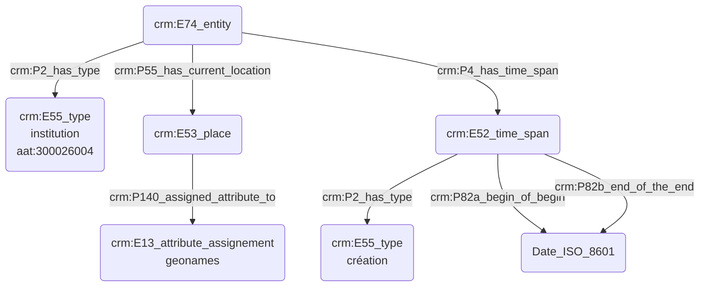

# Statut ou rôle au sein d'une institution

## a. Besoins musicologiques

## b. Problématisation

## c. Contextualisation technique

## d. Proposition Cidoc-CRM

G(crm:E21_person) -->|XXX| A(crm:E1_entity)
