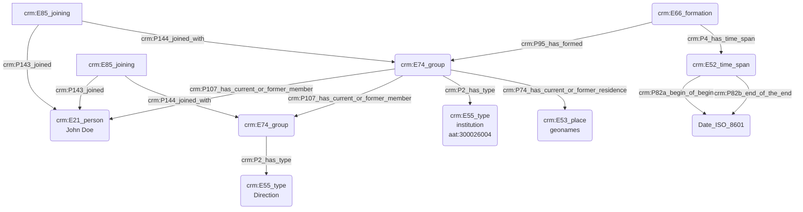

# Statut ou rôle au sein d'une institution

## a. Besoins musicologiques

## b. Problématisation

## c. Contextualisation technique 

## d. Proposition Cidoc-CRM

Aussi possible avec des E74 : sous-groupes 

