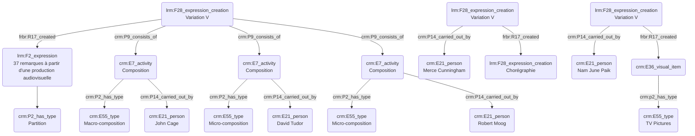

```mermaid
graph TD;

A(lrm:F28_expression_creation<br>Variation V) -->|frbr:R17_created| B(lrm:F2_expression<br>37 remarques à partir d'une production audiovisuelle)
B(lrm:F2_expression<br>37 remarques à partir d'une production audiovisuelle) --> C(crm:P2_has_type<br>Partition)
A(lrm:F28_expression_creation<br>Variation V) --> |crm:P9_consists_of| D(crm:E7_activity<br>Composition)
D(crm:E7_activity<br>Composition) --> |crm:P2_has_type| R(crm:E55_type<br>Macro-composition)
A(lrm:F28_expression_creation<br>Variation V) --> |crm:P9_consists_of| E(crm:E7_activity<br>Composition)
E(crm:E7_activity<br>Composition) --> |crm:P2_has_type| S(crm:E55_type<br>Micro-composition)
A(lrm:F28_expression_creation<br>Variation V) --> |crm:P9_consists_of| F(crm:E7_activity<br>Composition)
F(crm:E7_activity<br>Composition) --> |crm:P2_has_type| T(crm:E55_type<br>Micro-composition)
D(crm:E7_activity<br>Composition) --> |crm:P14_carried_out_by| G(crm:E21_person<br>John Cage)
E(crm:E7_activity<br>Composition) --> |crm:P14_carried_out_by| H(crm:E21_person<br>David Tudor)
F(crm:E7_activity<br>Composition) --> |crm:P14_carried_out_by| I(crm:E21_person<br>Robert Moog)

O(lrm:F28_expression_creation<br>Variation V) -->|crm:P14_carried_out_by| Q(crm:E21_person<br>Merce Cunningham)
O(lrm:F28_expression_creation<br>Variation V) -->|frbr:R17_created| K(lrm:F28_expression_creation<br>Chorégraphie)

P(lrm:F28_expression_creation<br>Variation V) -->|crm:P14_carried_out_by| L(crm:E21_person<br>Nam June Paik)
P(lrm:F28_expression_creation<br>Variation V) -->|frbr:R17_created| M(crm:E36_visual_item)
M(crm:E36_visual_item) --> |crm:p2_has_type| N(crm:E55_type<br>TV Pictures)

```

Mettre tous les E55 en couleur, possible avec mermaid ? Orange
