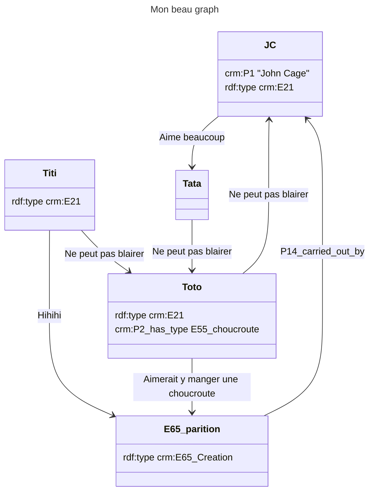

```mermaid
---
title: Mon beau graph
---
classDiagram

class JC {
    crm:P1 "John Cage"
    rdf:type crm:E21
}

class E65_parition {
    rdf:type crm:E65_Creation
}

class Toto {
rdf:type crm:E21
crm:P2_has_type E55_choucroute
}

class Titi {
rdf:type crm:E21
}

E65_parition --> JC: P14_carried_out_by
Toto --> JC: Ne peut pas blairer
Titi --> E65_parition: Hihihi
Titi --> Toto: Ne peut pas blairer
Tata --> Toto: Ne peut pas blairer
JC --> Tata: Aime beaucoup
Toto --> E65_parition: Aimerait y manger une choucroute

```
