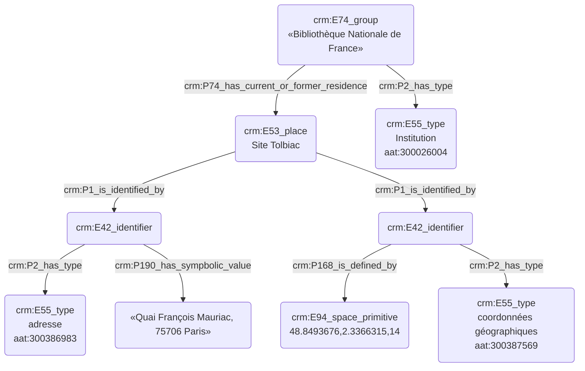

## Caractérisation d'un lieu 

### a. Besoins musicologiques

Lors du processus d'indexation conceptuelle, il est nécessaire de distinguer les lieux à l'aide de divers critères remarquables, tout en prenant soin - si besoin est - de relier chaque lieu à l'institution qu'il incarne. Il est également important de fournir des coordonnées GPS afin de pouvoir saisir la position géographique réelle du lieu, par exemple si l'institution a eu plusieurs sièges au fur et à mesure des années.

### b. Problématisation 

Comment modéliser un lieu tout en faisant apparaître l'institution à laquelle il se rattache, mais aussi son adresse ?

### c. Contextualisation technique

Cet exemple nous permet de présenter notre protocole complet d'identification des lieux, offrant une interopérabilité et une précision maximales. Nous faisons le choix de désigner le lieu tant par ses coordonnées géographiques que par son adresse :

Deux 'E42_identifier' sont reliés au 'E53_place'. Le premier d'entre eux signale ses coordonnées GPS ('E94_space_primitive')et le second son adresse, complétée par un identifiant geonames. Les deux concepts exprimés 'E42_identifier' sont typés par des entrées du thésaurus Getty AAT afin d'assurer une compréhension égale pour tous les usagers du protocole tout en assurant son interopérabilité. L'institution est également typé de manière similaire.

Les deux axes choisis se complètent et permettent de typer tout autant des lieux anciens, n'existant plus désormais ou bien ayant changé de localisation, qu'un site précis au sein d'un lieu en comportant plusieurs, comme c'est le cas pour la Bibliothèque Nationale de France.

### d. Proposition CIDOC CRM

