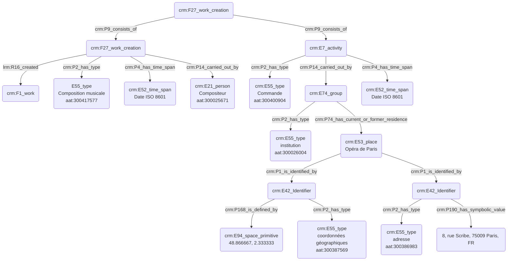

## Commanditaire d'une œuvre

### a. Besoins musicologiques

Nous avons besoin de modéliser la relation liant le commanditaire d'une œuvre au compositeur, ainsi que la pièce résultant de cette demande, le plus souvent caractérisée par une rétribution financière. Le commanditaire est souvent une personne morale (institution) plus qu'une personne physique ; nous nous attacherons néanmoins à expliciter ces deux possibilités distinctes. 

### b. Problématisation 
 
De quelle manière peut-on révéler l'aspect conséquentiel de l'œuvre - son écriture - suite à l'action du commanditaire et au passage de la commande ?

### c. Contextualisation technique

L'œuvre est exprimée selon le référentiel FRBR, se trouvant ici à son niveau le plus fondamental - _work_ -.
Le thesaurus Getty AAT nous permet de typer l'action de commande, tandis que l'institution est inscrite dans un champ spatio-temporel car étant le plus souvent reliée à un lieu bien précis, dans notre exemple l'Opéra de Paris, désigné selon notre protocole (voire [fiche dédiée]([https://github.com/Amleth/consortium-musica2-gt2-ontologies/blob/main/modules/livrables/Dossier%202/Indexation%20conceptuelle/indexation_d_un_lieu.md])). La date de commande de l'œuvre est  indiquée, ainsi que sa date de finalisation (date de rendu de la partition au commanditaire). 

### d. Proposition CIDOC CRM
_Commanditaire (institution)_


_Commanditaire (personne)_

```mermaid
graph TD;

M(crm:F27_work_creation) --> |crm:P9_consists_of| A(crm:F27_work_creation)
M(crm:F27_work_creation) --> |crm:P9_consists_of| C(crm:E7_activity)

A(crm:F27_work_creation) --> |lrm:R16_created| B(crm:F1_work)
A(crm:F27_work_creation) --> |crm:P2_has_type| N(E55_type<br>Composition musicale<br>aat:300417577)
A(crm:F27_work_creation) --> |crm:P4_has_time_span| J(crm:E52_time_span<br>Date ISO 8601)
A(crm:F27_work_creation) --> |crm:P14_carried_out_by| L(crm:E21_person<br>Compositeur<br>aat:300025671)

C(crm:E7_activity) --> |crm:P2_has_type| D(crm:E55_type<br>Commande<br>aat:300400904)
C(crm:E7_activity) --> |crm:P14_carried_out_by| E(crm:E21_person)
F(crm:E74_group) |crm:P107_has_current_or_former_member| E(crm:E21_person)
F(crm:E74_group) -->|crm:P2_has_type| F(crm:E55_type<br>institution<br>aat:300026004)
F(crm:E74_group) --> |crm:P74_has_current_or_former_residence| I(crm:E53_place<br>Opéra de Paris)

C(crm:E7_activity) --> |crm:P4_has_time_span| K(crm:E52_time_span<br>Date ISO 8601)
I(crm:E53_place<br>Opéra de Paris) --> |crm:P1_is_identified_by| V(crm:E42_Identifier)
V(crm:E42_Identifier) --> |crm:P168_is_defined_by| G(crm:E94_space_primitive<br>48.866667, 2.333333)
V(crm:E42_Identifier) --> |crm:P2_has_type| W(crm:E55_type<br>coordonnées géographiques<br>aat:300387569)


```

