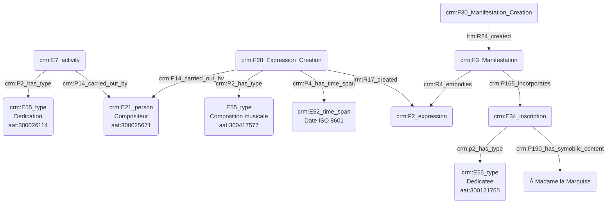

# Dédicataire d'une œuvre

## a. Besoins musicologiques

La dédicace d'une œuvre musicale diffère de la commande dans la mesure où n'elle n'induit aucun soutien financier, à moins que le commanditaire et le dédicataire soient la même personne. Le dédicataire peut-être un proche du compositeur, mais aussi une figure publique ; il peut s'agir d'un témoignage d'affection mais aussi d'admiration, sans nécessairement signaler un lien de proximité dans la vie réelle.

## b. Problématisation

Comment exprimer la dédicace, mention textuelle présente au sein de la partition ? Il s'agira également de distinguer clairement cette notion de la commande en marquant la différence entre l'aspect institutionnel de la commande et l'aspect plus personnel de la dédicace, mais aussi de distinguer l'étape de l'œuvre où la dédicace est fixée. 

## c. Contextualisation technique

Nous utilisons à nouveau le modèle FRBR pour type l'œuvre, qui se présente ici au niveau d'_expression_, puis de _manifestation_ une fois éditée. C'est lors de la création de l'expression que se décide la dédicace, qui sera ensuite _physiquement_ fixée sur la _manifestation_.
Le thesaurus Getty AAT est à nouveau utilisé afin de typer les différentes activités mais aussi statuts du graphe CIDOC CRM. Dans le cadre d'un cas concret, nous pourrons également ajouter des URI pour un niveau de précision accru. Nous faisons également appel au modèle FRBR en mettant en exergue la manifestation sur laquelle apparait la dédicace, représentée par l'entité ```crm:E34_inscription``` qui témoigne de la précense de la référence sur la source.

## d. Proposition CIDOC CRM



