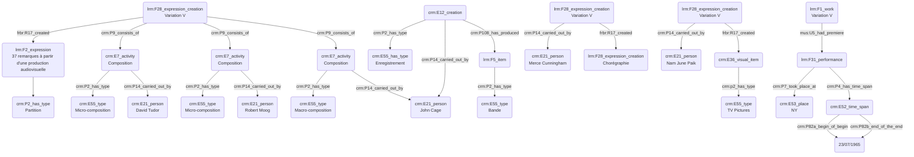

## Conservation des œuvres contemporaines

### **a. Besoins musicologiques**

### **b. Problématisation**

### **c. Contextualisation technique**

### **d. Proposition CIDOC CRM**

```mermaid
graph TD;

A(lrm:F28_expression_creation<br>Variation V) -->|frbr:R17_created| B(lrm:F2_expression<br>37 remarques à partir d'une production audiovisuelle)

A(lrm:F28_expression_creation<br>Variation V) --> |crm:P9_consists_of| E(crm:E7_activity<br>Composition) 
E(crm:E7_activity<br>Composition) --> |crm:P2_has_type| S(crm:E55_type<br>Micro-composition)
D(crm:E7_activity<br>Composition) --> |crm:P2_has_type| G(crm:E55_type<br>Macro-composition)
A(lrm:F28_expression_creation<br>Variation V) --> |crm:P9_consists_of| F(crm:E7_activity<br>Composition)
D(crm:E7_activity<br>Composition) --> |crm:P14_carried_out_by| R(crm:E21_person<br>John Cage)
F(crm:E7_activity<br>Composition) --> |crm:P2_has_type| T(crm:E55_type<br>Micro-composition)
E(crm:E7_activity<br>Composition) --> |crm:P14_carried_out_by| H(crm:E21_person<br>David Tudor)
F(crm:E7_activity<br>Composition) --> |crm:P14_carried_out_by| I(crm:E21_person<br>Robert Moog)
A(lrm:F28_expression_creation<br>Variation V) --> |crm:P9_consists_of| D(crm:E7_activity<br>Composition)
B(lrm:F2_expression<br>37 remarques à partir d'une production audiovisuelle) --> C(crm:P2_has_type<br>Partition)

W(crm:E12_creation) --> |crm:P2_has_type| X(crm:E55_has_type<br>Enregistrement)
Y(lrm:F5_item) --> |crm:P2_has_type| V(crm:E55_type<br>Bande)
W(crm:E12_creation) ---> |crm:P14_carried_out_by| R(crm:E21_person<br>John Cage)
W(crm:E12_creation) --> |crm:P108_has_produced| Y(lrm:F5_item)

O(lrm:F28_expression_creation<br>Variation V) -->|crm:P14_carried_out_by| Q(crm:E21_person<br>Merce Cunningham)
O(lrm:F28_expression_creation<br>Variation V) -->|frbr:R17_created| K(lrm:F28_expression_creation<br>Chorégraphie)

P(lrm:F28_expression_creation<br>Variation V) -->|crm:P14_carried_out_by| L(crm:E21_person<br>Nam June Paik)
P(lrm:F28_expression_creation<br>Variation V) -->|frbr:R17_created| M(crm:E36_visual_item)
M(crm:E36_visual_item) --> |crm:p2_has_type| N(crm:E55_type<br>TV Pictures)

Z(lrm:F1_work<br>Variation V) -->|mus:U5_had_premiere| AA(lrm:F31_performance)
AA(lrm:F31_performance) --> |crm:P7_took_place_at| AB(crm:E53_place<br>NY)
AA(lrm:F31_performance) -->|crm:P4_has_time_span| AC(crm:E52_time_span)
AC(crm:E52_time_span) -->|crm:P82a_begin_of_begin| AD(23/07/1965)
AC(crm:E52_time_span) -->|crm:P82b_end_of_the_end| AD(23/07/1965)

```

