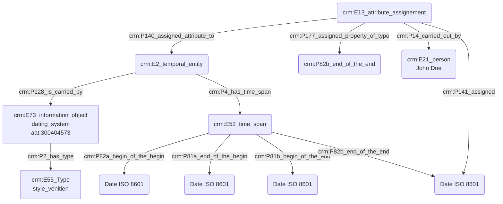

# Expression d'une date initialement présentée dans un autre référentiel calendaire

## a. Besoins musicologiques

Les chercheurs spécialisés en musicologie historique naviguent entre un grand nombre de référentiels calendaires. Il convient de proposer une convention de notation offrant une compréhension immédiate à travers la modélisation de dates en Cidoc-CRM, tout en permettant aux chercheurs de témoigner d'incertitudes mais aussi d'éclairer la méthodologie derrière la conversion des dates et justifier leur choix.

## b. Problématisation

De quelle manière exprimer de manière compréhensible une date originellement exprimée dans un référentiel calendaire ancien, ou peu commun ?

## c. Contextualisation technique

Les ateliers menés auprès de musicologues nous ont permis d'orienter les résultats vers une nécessaire uniformisation des dates au format ISO 8601. Le chercheur peut, s'il le souhaite, faire part d'un commentaire précis par l'usage d'un 'E13_Attribute_Assignement' ; dans cet exemple, le commentaire signale une attention particulière à accorder à la date de fin la plus tardive, signée de la main de son auteur par l'emploi d'un 'E21_person'.

## d. Proposition CIDOC CRM 

