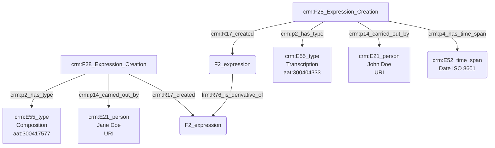

## Transcription d'une œuvre

### a. Besoins musicologiques

L'acte de transcription musicale implique un certain nombre d'entités qu'il convient d'identifier avec précision dans le cadre de l'indexation conceptuelle : œuvre originelle, œuvre transcrite, compositeur et transcripteur, dans l'éventualité où les deux tâches seraient accomplies par des personnes différentes.

### b. Problématisation

De quelle manière peut-on exprimer l'action de transcription d'une œuvre existante ? 

### c. Contextualisation technique

Nous nous appuyons sur le modèle FRBR pour caractériser l'œuvre ; dans le cadre d'une transcription, le niveau auquel nous nous intéressons est celui de l'expression et est intégré dans le graphe par l'usage de 'F2_expression', portées par des personnes 'E21_person' - clairement nommées et identifiées, si possible à l'aide d'une URI- , tandis que les actions de transcription et de composition sont typées à l'aide du Thésaurus Getty AAT. Celles-ci résultent en des 'F28_Expression_Creation'.

### d. Proposition CIDOC CRM

