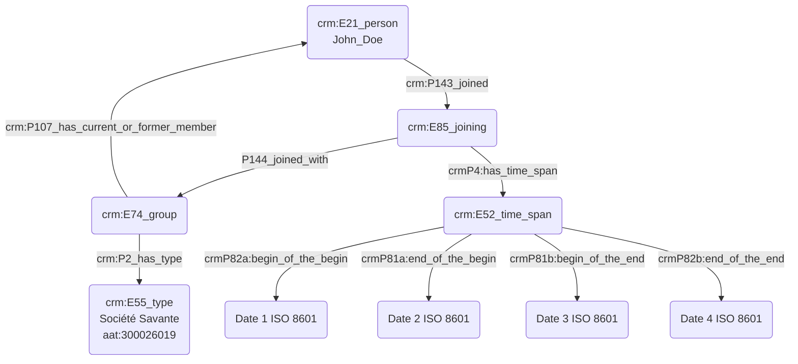

## Appartenance à un groupe social

### a. Besoins musicologiques

L'appartenance à un groupe - qu'il soit publiquement identifié (par exemple une association, une société savante, etc...) - ou bien lié à l'association plus ou moins informelle de diverses personnalités (par exemple, le "Groupe des six") permet de reconstituer des liens inter-personnels dans l'optique d'un travail de recherche musicologique. Nous pouvons ainsi témoigner d'une certaine influence esthétique chez une personne liée à la fréquentation d'un cercle promeuvant une certaine idéologie, _etc_.

### b. Problématisation

De quelle manière peut-on matérialiser l'appartenance à un groupe afin de témoigner d'une rencontre au sein d'un même cercle ?

### c. Contextualisation technique

Nous utilisons un 'E74_group' lié à la personne concernée par un 'E85_joining'. Le 'E74_group' doit nécessairement être typé, ici à l'aide du thésaurus Getty AAT, afin de représenter la fonction / valeur du groupe. La date d'entrée au sein du groupe est également indiquée ; à noter que si celle-ci est incertaine, il convient d'utiliser un 'E13_attribute_assignement' pour préciser le raisonnement derrière l'attribution de cette date.

**P107 est plus pauvre qu'utiliser un E85 voir la notion de shortcut en CIDOC CRM** 

### d. Proposition CIDOC CRM

