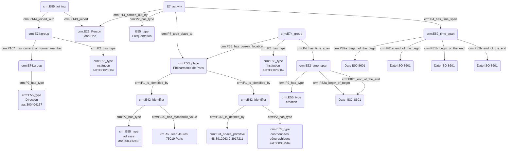

## Fréquentation d'une institution

### a. Besoins musicologiques

Il est souvent nécessaire de témoigner de la présence d'une personne au sein d'une institution, en détaillant s'il s'agit d'un simple passage ou bien d'une inscription réelle au sein de celle-ci. Nous avons donc besoin d'informations spatio-temporelles, mais aussi de typer les statuts et/ou fonctions des personnes concernées, tout en se référant à des ressources existantes telles que des thésaurus.

### b. Problématisation

Comment modéliser la présence d'une personne au sein d'une institution ? Quels sont les outils nous permettant de typer la nature de la fréquentation ?

### c. Contextualisation technique

Nous croisons ici l'usage de trois de nos protocoles ; sur les dates, les lieux et les statuts et fonctions. La mise en relation de ces derniers avec un 'E21_Person' permet de tisser des liens complémentaires entre l'individu et l'institution.

### d. Proposition CIDOC CRM

