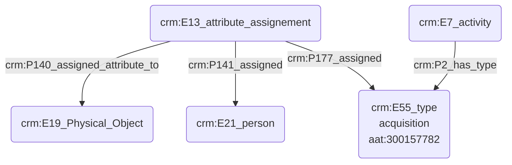

# Propriétaire d'un objet

## a. Besoins musicologiques

Dans le cadre d'études organologiques, il peut être intéressant de témoigner l'appartenance d'un instrument à une personne donnée, afin de retracer l'historique de l'instrument, étudier l'évolution de sa pratique, _etc_.

## b. Problématisation

Comment exprimer le fait qu'une personne soit propriétaire d'un objet ?

## c. Contextualisation technique

Nous utilisons ici un 'E13_attribute_assignement' pour commenter l'acquisition d'un objet physique 'E19_Physical_Object'. L'action d'acquisition est une activité 'E7_activity' typée à l'aide d'une entrée du Getty AAT.

## d. Proposition CIDOC CRM

