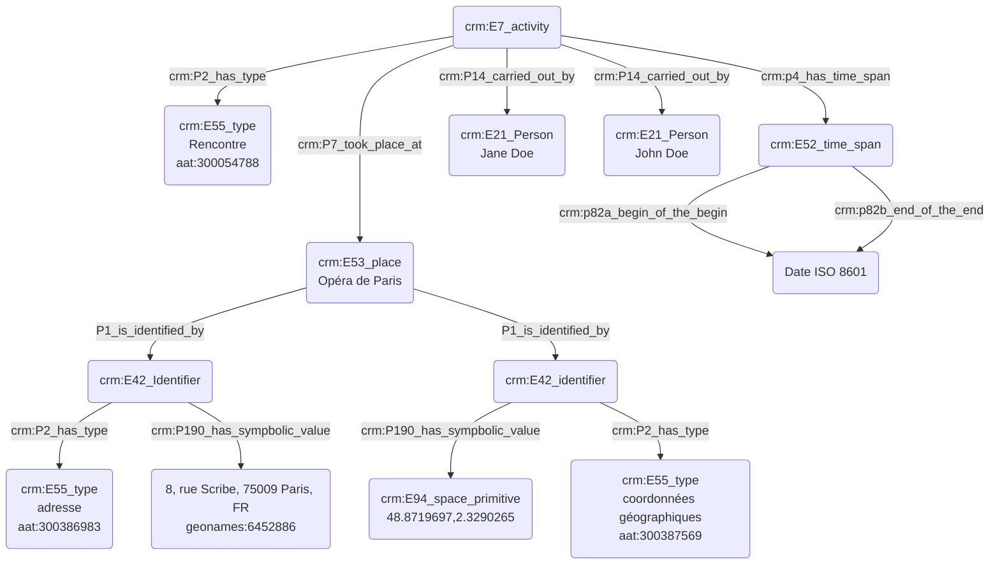

# Rencontre de quelqu'un dans un lieu fréquenté par les deux personnes

## a. Besoins musicologiques

Le lien entre deux personnes peut être établi à travers la fréquentation commune d'un lieu. En ce sens, il est nécessaire de pouvoir modéliser la présence des deux personnes au même endroit mais aussi au même moment, afin de témoigner de leur rencontre.

## b. Problématisation

Comment exprime-t'on la présence simultanée de deux personnes au sein d'un même lieu, et le fait qu'elles se rencontrent ?

## c. Contextualisation technique

Nous utilsons un ```crm:E7_activity``` pour désigner l'action de rencontre, ensuite typée à l'aide d'une entrée du Getty AAT. Cette rencontre est enrichie d'une date, marquant la simultanéité de la présence des deux personnes, et des informations concernant le lieu.

## d. Proposition Cidoc-CRM




