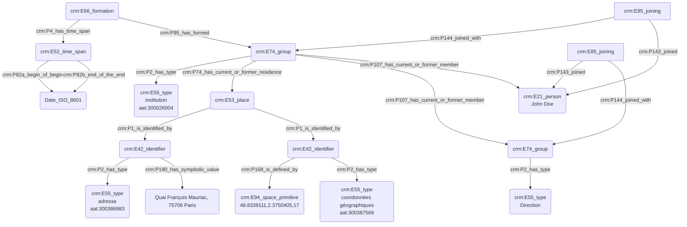

## Statut ou rôle au sein d'une institution

### a. Besoins musicologiques

Les rôles endossés par des personnes varient dans leurs appelations et significations au fil du temps. Il est donc important de pouvoir typer les responsabilités à l'aide d'un thésaurus, mais aussi de pouvoir exprimer un niveau de détail élevé vis-à-vis des informations à disposition, en faisant preuve de plus ou moins de précision.

### b. Problématisation

Comment exprime-t'on le statut et/ou la fonction d'une personne vis-à-vis de l'institution dont elle dépend ?

### c. Contextualisation technique

Nous présentons ici le protocole permettant de préciser le statut et/ou la fonction d'une personne au sein d'une institution. Nousavons fait le choix d'exprimer la fonction d'une personne par l'usage de deux 'E74_group' ; le premier d'entre eux correspond à la structure qui accueille la personne et le second, inclus dans le premier, détaille la fonction occupée. Il est posssible de raffiner encore plus le processus par l'usage de 'E74_group' supplémentaires, jusqu'à arriver au niveau de précision attendu. Les concepts adjacents aux 'E74_group' sont typés à l'aide du Getty AAT pour assurer une interopérabilité maximale.

