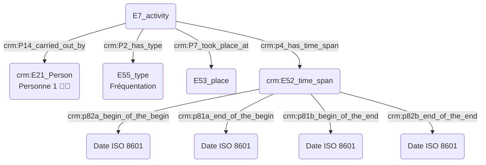
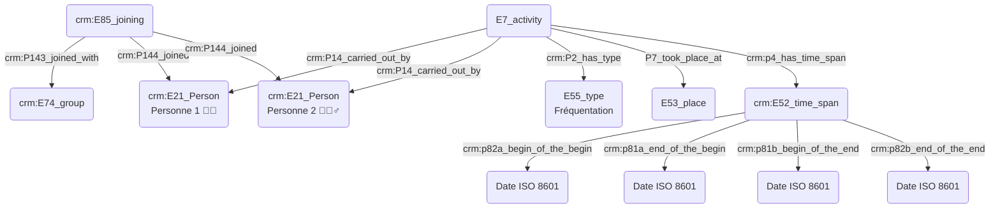
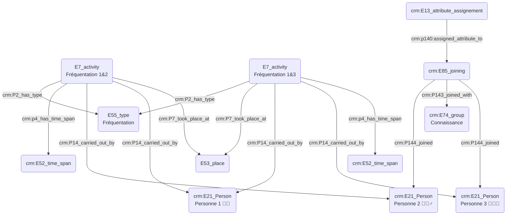

**Prosopographie :**  
- Quelqu'un a fréquenté un lieu :
  

- Quelqu'un a rencontré quelqu'un dans un lieu qu'ils on tous deux fréquentés :
  

- Quelqu'un a rencontré quelqu'un par le biais d'une tierce personne au sein d'un même lieu :

