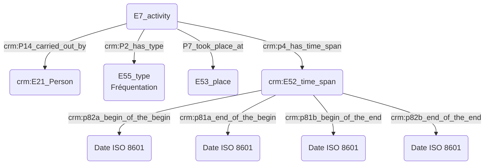

**Prosopographie : **

- Quelqu'un a fréquenté un lieu :

```mermaid
graph TD;

B(E7_activity) -->|crm:P14_carried_out_by| A(crm:E21_Person)
B(E7_activity) -->|crm:P2_has_type| C(E55_type<br>Fréquentation)

B(E7_activity) -->|P7_took_place_at| I(E53_place)

B(E7_activity) --> |crm:p4_has_time_span| D(crm:E52_time_span)
D(crm:E52_time_span) --> |crm:p82a_begin_of_the_begin| E("Date ISO 8601")
D(crm:E52_time_span) --> |crm:p81a_end_of_the_begin| F("Date ISO 8601")
D(crm:E52_time_span) --> |crm:p81b_begin_of_the_end|G("Date ISO 8601")
D(crm:E52_time_span) --> |crm:p82b_end_of_the_end| H("Date ISO 8601")


```
