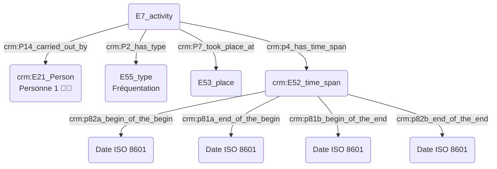
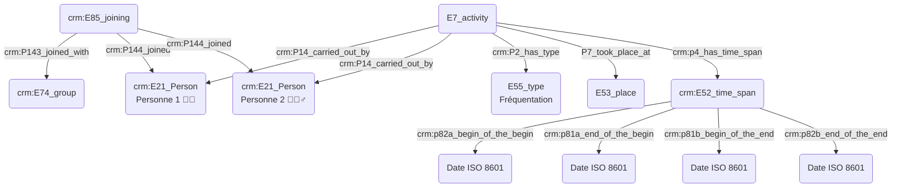
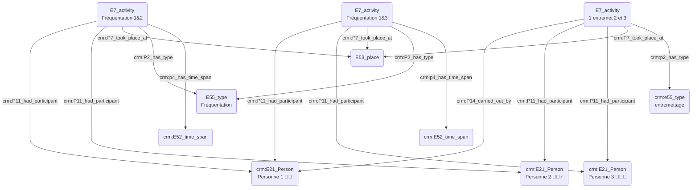

# **Prosopographie :**  

## Introduction : 

- Introduction AB et TB : définition de la _prosopographie_ : étude biographique visant à souligner les caractères communs d'un groupe d'acteurs historiques. Lien direct avec la musicologie historique mais aussi rattachement aux sciences sociales. 
- Présentation des différents intervenants et de leurs rapports aux enjeux prosopographiques.

## 1. Quelles sont les situations où les enjeux prosopographiques sont importants ?

- Comment vient-on à utiliser une méthodologie prosopographique ?
- Quand le besoin prosopographique est-il nécessaire ? Question du doute et de la désambiguïsation, de la non-correspondance des sources ?

- Réponses des participants à ces questions, exemples et cas concrets utiles. 

## 2. Quelle est la méthodologie appliquée dans le cadre d'une recherche prosopographique ? 

- Systématiser une méthode ? Quels sont les éléments indispensables ?
- Lien vers l'atelier datation, la notion d'incertitude est absolument primordiale.
- Pour les informations de lieu, il est important de contextualiser au maximum avec l'institution rattachée (le cas échéant).
- Comment indiquer les lieux avec précision ? Nécessité d'alignement des référentiels, de manière similaire à la datation.
  
- Dans le cadre de l'usage du Cidoc-CRM, besoin constant de E13 afin d'éclaircir la lecture des informations notées.

- Réponses des participants à ces questions, exemples et cas concrets utiles.
- Définir une méthodologie-type ; trouver les bons outils en fonction de la question posée, quelles étapes et leur ordre, les éléments à posséder en amont ? Définir des incertitudes acceptables, adopter les bons référentiels...

## Exemples de modélisations prosopographiques à l'aide de l'ontologie Cidoc-CRM :

### - Quelqu'un a fréquenté un lieu :
  

### - Quelqu'un a rencontré quelqu'un dans un lieu qu'ils on tous deux fréquentés :
  

### - Quelqu'un a rencontré quelqu'un par le biais d'une tierce personne au sein d'un même lieu :

