```mermaid
graph TD;

B(E7_activity) -->|crm:P14_carried_out_by| A("crm:E21_Person<br>Personne 1 👩🏼")
B(E7_activity) -->|crm:P2_has_type| C(E55_type<br>Fréquentation)

B(E7_activity) -->|crm:P7_took_place_at| I(E53_place)

B(E7_activity) --> |crm:p4_has_time_span| D(crm:E52_time_span)
D(crm:E52_time_span) --> |crm:p82a_begin_of_the_begin| E("Date ISO 8601")
D(crm:E52_time_span) --> |crm:p81a_end_of_the_begin| F("Date ISO 8601")
D(crm:E52_time_span) --> |crm:p81b_begin_of_the_end|G("Date ISO 8601")
D(crm:E52_time_span) --> |crm:p82b_end_of_the_end| H("Date ISO 8601")
```

```mermaid
graph TD;

B(E7_activity) -->|crm:P14_carried_out_by| A("crm:E21_Person<br>Personne 1 👩🏼")
B(E7_activity) -->|crm:P14_carried_out_by| J("crm:E21_Person<br>Personne 2 🧔🏻‍♂️")
B(E7_activity) -->|crm:P2_has_type| C(E55_type<br>Fréquentation)

B(E7_activity) -->|P7_took_place_at| I(E53_place)
K(crm:E85_joining) -->|crm:P143_joined_with| L(crm:E74_group)
K(crm:E85_joining) -->|crm:P144_joined| A("crm:E21_Person<br>Personne 1 👩🏼")
K(crm:E85_joining) -->|crm:P144_joined| J("crm:E21_Person<br>Personne 2 🧔🏻‍♂️")


B(E7_activity) --> |crm:p4_has_time_span| D(crm:E52_time_span)
D(crm:E52_time_span) --> |crm:p82a_begin_of_the_begin| E("Date ISO 8601")
D(crm:E52_time_span) --> |crm:p81a_end_of_the_begin| F("Date ISO 8601")
D(crm:E52_time_span) --> |crm:p81b_begin_of_the_end|G("Date ISO 8601")
D(crm:E52_time_span) --> |crm:p82b_end_of_the_end| H("Date ISO 8601")

```

**Prosopographie :**  
- Quelqu'un a fréquenté un lieu :
  

- Quelqu'un a rencontré quelqu'un dans un lieu qu'ils on tous deux fréquentés :
  

- Quelqu'un a rencontré quelqu'un par le biais d'une tierce personne au sein d'un même lieu :

```mermaid
graph TD;


B(E7_activity<br>Fréquentation 1&2) -->|crm:P2_has_type| F(E55_type<br>Fréquentation)
D(E7_activity<br>Fréquentation 1&3) -->|crm:P2_has_type| F(E55_type<br>Fréquentation)

B(E7_activity<br>Fréquentation 1&2) ---> |crm:p4_has_time_span| I(crm:E52_time_span)

B(E7_activity<br>Fréquentation 1&2) ---->|crm:P14_carried_out_by| C("crm:E21_Person<br>Personne 2 🧔🏻‍♂️")
B(E7_activity<br>Fréquentation 1&2) ---->|crm:P14_carried_out_by| A("crm:E21_Person<br>Personne 1 👩🏼")
D(E7_activity<br>Fréquentation 1&3) --->|crm:P7_took_place_at| S(E53_place)
B(E7_activity<br>Fréquentation 1&2) --->|crm:P7_took_place_at| S(E53_place)
D(E7_activity<br>Fréquentation 1&3) ---->|crm:P14_carried_out_by| A("crm:E21_Person<br>Personne 1 👩🏼")
D(E7_activity<br>Fréquentation 1&3) ---->|crm:P14_carried_out_by| E("crm:E21_Person<br>Personne 3 👩🏻‍🦰")

D(E7_activity<br>Fréquentation 1&3) ---> |crm:p4_has_time_span| N(crm:E52_time_span)

G(crm:E85_joining) ---->|crm:P144_joined| C("crm:E21_Person<br>Personne 2 🧔🏻‍♂️")
G(crm:E85_joining) -->|crm:P143_joined_with| H(crm:E74_group<br>Connaissance)
G(crm:E85_joining) ---->|crm:P144_joined| E("crm:E21_Person<br>Personne 3 👩🏻‍🦰")

O(crm:E13_attribute_assignement) --->|crm:p140:assigned_attribute_to| G(crm:E85_joining)

```

