# **Prosopographie :**  

## Introduction : 

- Introduction AB et TB : définition de la _prosopographie_ : étude biographique visant à souligner les caractères communs d'un groupe d'acteurs historiques. Lien direct avec la musicologie historique mais aussi rattachement aux sciences sociales. 
- Présentation des différents intervenants et de leurs rapports aux enjeux prosopographiques.

## 1. Quelles sont les situations où les enjeux prosopographiques sont importants ?

- Comment vient-on à utiliser une méthodologie prosopographique ?
- Quand le besoin prosopographique est-il nécessaire ? Question du doute et de la désambiguïsation, de la non-correspondance des sources ?

- Réponses des participants à ces questions, exemples et cas concrets utiles. 

## 2. Quelle est la méthodologie appliquée dans le cadre d'une recherche prosopographique ? 

- Systématiser une méthode ? Quels sont les éléments indispensables ?
- Lien vers l'atelier datation, la notion d'incertitude est absolument primordiale.
- Pour les informations de lieu, il est important de contextualiser au maximum avec l'institution rattachée (le cas échéant).
- Comment indiquer les lieux avec précision ? Nécessité d'alignement des référentiels, de manière similaire à la datation.
  
- Dans le cadre de l'usage du Cidoc-CRM, besoin constant de E13 afin d'éclaircir la lecture des informations notées.

- Réponses des participants à ces questions, exemples et cas concrets utiles.
- Définir une méthodologie-type ; trouver les bons outils en fonction de la question posée, quelles étapes et leur ordre, les éléments à posséder en amont ? Définir des incertitudes acceptables, adopter les bons référentiels...

## Exemples de modélisations prosopographiques à l'aide de l'ontologie Cidoc-CRM :

### - Quelqu'un a fréquenté un lieu :

```mermaid
graph TD;

B(E7_activity) -->|crm:P14_carried_out_by| A("crm:E21_Person<br>Personne 1 👩🏼")
B(E7_activity) -->|crm:P2_has_type| C(E55_type<br>Fréquentation)

B(E7_activity) -->|crm:P7_took_place_at| I(E53_place)

B(E7_activity) --> |crm:p4_has_time_span| D(crm:E52_time_span)
D(crm:E52_time_span) --> |crm:p82a_begin_of_the_begin| E("Date ISO 8601")
D(crm:E52_time_span) --> |crm:p81a_end_of_the_begin| F("Date ISO 8601")
D(crm:E52_time_span) --> |crm:p81b_begin_of_the_end|G("Date ISO 8601")
D(crm:E52_time_span) --> |crm:p82b_end_of_the_end| H("Date ISO 8601")
```
  

### - Quelqu'un a rencontré quelqu'un dans un lieu qu'ils on tous deux fréquentés :

```mermaid
graph TD;

B(E7_activity) -->|crm:P14_carried_out_by| A("crm:E21_Person<br>Personne 1 👩🏼")
B(E7_activity) -->|crm:P14_carried_out_by| J("crm:E21_Person<br>Personne 2 🧔🏻‍♂️")
B(E7_activity) -->|crm:P2_has_type| C(E55_type<br>Fréquentation)

B(E7_activity) -->|P7_took_place_at| I(E53_place)
K(crm:E85_joining) -->|crm:P143_joined_with| L(crm:E74_group)
K(crm:E85_joining) -->|crm:P144_joined| A("crm:E21_Person<br>Personne 1 👩🏼")
K(crm:E85_joining) -->|crm:P144_joined| J("crm:E21_Person<br>Personne 2 🧔🏻‍♂️")


B(E7_activity) --> |crm:p4_has_time_span| D(crm:E52_time_span)
D(crm:E52_time_span) --> |crm:p82a_begin_of_the_begin| E("Date ISO 8601")
D(crm:E52_time_span) --> |crm:p81a_end_of_the_begin| F("Date ISO 8601")
D(crm:E52_time_span) --> |crm:p81b_begin_of_the_end|G("Date ISO 8601")
D(crm:E52_time_span) --> |crm:p82b_end_of_the_end| H("Date ISO 8601")

```
  

### - Quelqu'un a rencontré quelqu'un par le biais d'une tierce personne au sein d'un même lieu :

```mermaid
graph TD;



B(E7_activity<br>Fréquentation 1&2) ----->|crm:P11_had_participant| A("crm:E21_Person<br>Personne 1 👩🏼")
D(E7_activity<br>Fréquentation 1&3) ----->|crm:P11_had_participant| A("crm:E21_Person<br>Personne 1 👩🏼")
O(E7_activity<br>1 entremet 2 et 3) ----->|crm:P14_carried_out_by| A("crm:E21_Person<br>Personne 1 👩🏼")
B(E7_activity<br>Fréquentation 1&2) ----->|crm:P11_had_participant| C("crm:E21_Person<br>Personne 2 🧔🏻‍♂️")
O(E7_activity<br>1 entremet 2 et 3) ----->|crm:P11_had_participant| C("crm:E21_Person<br>Personne 2 🧔🏻‍♂️")
D(E7_activity<br>Fréquentation 1&3) ----->|crm:P11_had_participant| E("crm:E21_Person<br>Personne 3 👩🏻‍🦰")
O(E7_activity<br>1 entremet 2 et 3) ----->|crm:P11_had_participant| E("crm:E21_Person<br>Personne 3 👩🏻‍🦰")

D(E7_activity<br>Fréquentation 1&3) -->|crm:P7_took_place_at| M(E53_place)
B(E7_activity<br>Fréquentation 1&2) -->|crm:P7_took_place_at| M(E53_place)
O(E7_activity<br>1 entremet 2 et 3) --> |crm:P7_took_place_at| M(E53_place)

B(E7_activity<br>Fréquentation 1&2) --->|crm:P2_has_type| F(E55_type<br>Fréquentation)
D(E7_activity<br>Fréquentation 1&3) --->|crm:P2_has_type| F(E55_type<br>Fréquentation)
O(E7_activity<br>1 entremet 2 et 3) ---> |crm:p2_has_type| P(crm:e55_type<br>entremettage)

B(E7_activity<br>Fréquentation 1&2) ----> |crm:p4_has_time_span| I(crm:E52_time_span)
D(E7_activity<br>Fréquentation 1&3) ----> |crm:p4_has_time_span| N(crm:E52_time_span)



```

