# Atelier n° 4 : prosopographie

# Tour de table

- Augustin Braud
- Thomas Bottini
- Achille Davy-Rigaux
    Au contact de la base MUSEFREM
- Nancy Hachem
    Lieux, gens, gens dans ces lieux : comment mieux modéliser ?
- Christophe Corbier
    Pour une recherche en cours sur un ensemble d'archives sonores et écrites sur Hubert Pernot (héléniste, enregistrements sur l'île de Chios en 1898–1899).
    Approche prosopographique centrale : identifier les informateurs en France et en Grèce.
- Jonathan Parisi
    Mediabase du Palazzetto Bru Zane
    Dezède
- Aurélien Balland Chatignon
- Kévin Roger
    Ingénieur Biblissima+ (agrégation des données historiques liées au patrimoine écrit). Question au sein de ce projet : comment identifier numériquement un individu ?
- Lucia Parisi
    Postdoc à la Haute École de Berne
    Répertoire de la mélodie française importé dans Dezède, 30000 œuvres, donc beaucoup d'individus (compositeurs, poètes, dédicataires).
- Théodora Psychoyou
    BDD sur un corpus d'écrits sur la musique qui mobilise une série d'auteur dont il est intéressant de définir le profil (protocole de la base Philidor du CMBV). Nom, date, statut des auteurs (maître de musique, facteur d'instruments, mathématicien, philosophe, géomètre…). Méta-index des noms (index des index des traités).
- Guillaume Avocat
    Ingénieur CESR
    Contributeur MUSEFREM
    Projet de recherche sur la musique d'Église au XIXe contenant une BDD
- Suzy Piat
    Base Ricercar, individus, événements (dates), œuvres
- Nathalie Berton-Blivet
    Référentiel des lieux de la France de l'Ancien Régime
    ANR Acadec consacrée aux académies de province au XVIIIe, croisement de données avec MUSEFREM, parcours professionnels de certains gagistes.
- Sarra Ferjani
    CESR base Ricercar
    Personnes (programme des BVH) : ontologie autour de la gestion des agents/personnes
    Créer des méthodologies non centrées sur une discipline, mais favorisant le dialogue entre BDD qui détiennent des personnes en commun.
- Aurélie Vasile
    MSH Clermont-Ferrand
    BDD « Spectacles de curiosités » prosopographique des voyages de personnes au XVIIIe siècle qui ont présenté des spectacles de curiosités (ex : événement qui dit quand une personne arrive dans une ville au moment de l'enregistrement par les autorités).
- Marco Gurrieri
    Métadonnées des entêtes MEI

De ce tour de table émerge la friction avec la question de l'*identification* des personnes et le *recours à des référentiels* de personnes.

# À quel moment intervient la méthode/les bases prosopographiques ?

MG :
une base prosopographique regroupe des données qui sont des métadonnées dans d'autres projets. La récolte du matériau, phase 1, n'est que la base. Le vrai enjeu prosopographique se fait dans une deuxième phase, sur l'étude des liens entre personnes et institutions. Les données prosopographiques sont les résultats inférés à partir de ce qui a été récolté, ce sont des données d'essence relationnelle. Ne pas croire que la phase 1 est prosopographique.

NH :
Quand il y a foisonnement et éparpillement des documents, la constitution de données prosopographiques constitue un outil de recherche et d'appropriation des corpus. Il n'y a pas vraiment de phase 1 dans ce cas.

GA :
Cela dépend de la question de base, pose t-on une question prosopographique au départ du projet ? (c'est le cas de MUSEFREM, de Ricercar). Un autre projet pourra vouloir constituer des données brutes, et les données prosopographiques émergeront d'une mise en regard des données avec celles d'autres projets.
Note : dans Ricercar, il y a des centaines de personnes qui n'existent pas ailleurs sur le Web.

NBB :
La BDD n'est qu'un support, le travail prosopographique ne se fait qu'à partir de l'exploitation des données.

# Personnes

## Personne physique ou morale ?

SF :
Personne : physique ou morale ?

JP :
Dezède distingue : personne physique/institution.
Une notice par institution (avec la succession des noms qu'elle a pu avoir dans l'histoire).

## Personne réelle ou fictive ?

KR :
Quid des personnages mythologiques ?

JP :
Dans Dezède, il y a les rôles, donc des autorités rôles.

TP :
Même cas dans le méta-index. Attribution à des figures mythologiques.

KR :
Comment fait-on dans le CRM ?

TB :
Réponse fonctionnaliste et non substantialiste.

JP :
Une autorité individu réelle et fictive ne peuvent pas être utilisées de la même manière.

TB :
Un événement de création peut-il engendrer des personnages modélisés comme des E21 ?
Un crm:P2_has_type E55/fictif sur les E21 ?

KR :
On ne mélange pas contexte fictif et réel, la prosopographie demeure dans un contexte commun.

## Statut/rôle/fonction d'une personne ?

TP :
Statut

LP :
Dezède : deux types de statuts/rôles : à chaque personne sont associés plusieurs statuts (compositeur, poète, chanteur, librettiste), pas de vocabulaire figé. On peut indiquer sur la page d'un individu s'il a des relations familiales ou professionnelles (élève, maître, dédicataire) avec un autre individu (ces relations sont dans un vocabulaire contrôlé).

TB :
Comment modéliser les notions de dédicataire, de commandiraire informel et d'hommage en CRM ?

NBB :
Toute relation doit s'accompagner de la mention des périodes et des dates.

TP :
Différence entre statut et rôle (à détacher de la prosopographie de la personne).
Comment modéliser la notion de propriété ? (« Tel ouvrage appartient à Brossard ?»).
Pouvoir désigner une personne selon une facette.

TB :
Quand on indexe une personne, on indexe la personne en qualité de la fonction selon laquelle on la considère (Théodora en tant que directrice de l'IReMus, ou, Théodora en tant que spécialiste des rapports entre musique et sciences aux XVIIe et XVIIIe siècles).

NH :
Dans les documents juridiques, les personnes sont désignées selon leur métier ou leur titre.

TB :
Petit topo sur les E7, E21, E12/E65…

LP :
Oui mais si n'a pas de dates, ça n'obère pas cette modélisation ?

TB :
Non, et c'est un modèle accueillant et ouvert.

JP : 
Statut/profession.
Rôle/poste/fonction.
Le statut ne détermine pas notre fonction.
On est toujours musicologue/penseur de la musique même hors du cadre de notre fonction
Mais comment juste dire que LVB était pédagogue ?

TB : On ne construirait pas un graphe dénotant l'activité pédagogique de LVB (car les données sont lacunaires), mais un E13 signé par un chercheur qui éprouverait le besoin de distribuer l'étiquette "pédagogue". Cet étiquetage pourrait alors être discuté sur le Web.

NH : Question : Suzy, Guillaume, Sarra, avez-vous travaillé sur la prosopographie des chantres de la Renaissance, comment ont été construites les étiquettes (composer, musician singer, master of music) ?

SF : Ces rôles ne sont pas reliés à des événements particuliers, mais attribués à une personne comme parties de son identité. Avons défini une liste fermée des choix des différents rôles.

GA : Synthèse des échanges : on peut associer un rôle à une personne, ou associer un rôle à une personne par le truchement d'un événement.

TB : S'investir dans ```crm:P14.1_in_the_role_of```.

## Relations

MG : Caractère symétrique (frère) ou non (maître/élève) de la relation.

LP : Dans Dezède, si A est élève de B, alors B est maître de A (automatiquement).

JP : Démo de https://dezede.org/individus/falla/. Les fonctions sont collectées en regardant le graphe, et dynamiquement injectée dans le cartouche de présentation de la personne.

# Institutions

JP : Chef de tel institution de telle date à telle date. Théâtre qui contient deux salles. Théâtre éphèmère. Tout cela fonctionne assez bien dans Dezède. Dans le cas d'une programmation d'une institution dans une autre institution mais dans le cadre de sa propre programmation.

# Webographie

- https://spectacle-de-curiosites.msh.uca.fr/
- https://philidor.cmbv.fr/Publications/Bases-prosopographiques/MUSEFREM-Base-de-donnees-prosopographique-des-musiciens-d-Eglise-en-1790
- https://ricercar.pcr.cesr.univ-tours.fr/
- http://ricercar-old.cesr.univ-tours.fr/3-programmes/basechanson/03231-0.htm
- https://performart.huma-num.fr/
- https://dezede.org/
- https://shs.hal.science/halshs-03406115/file/Beretta_Alamercery_ReUSE_Nantes_20211019.pdf
- https://shs.hal.science/halshs-03764597/document
- https://phn-wiki.ish-lyon.cnrs.fr/doku.php?id=intro_histoire_numerique:conceptualisation_information
- https://ontome.net/namespace/3#namespace-hierarchy

<hr/>

# Notes préparatoires

## Introduction : 

- Introduction AB et TB : définition de la _prosopographie_ : étude biographique visant à souligner les caractères communs d'un groupe d'acteurs historiques, qu'est-ce qui fait réseau ? Lien direct avec la musicologie historique mais aussi rattachement aux sciences sociales. 
- Présentation des différents intervenants et de leurs rapports aux enjeux prosopographiques.

## 1. Quelles sont les situations où les enjeux prosopographiques sont importants ?

- Comment vient-on à utiliser une méthodologie prosopographique ?
- Quand l'outil prosopographique est-il nécessaire ? Question du doute et de la désambiguïsation, de la non-correspondance des sources ?

- Réponses des participants à ces questions, exemples et cas concrets utiles. 

## 2. Quelle est la méthodologie appliquée dans le cadre d'une recherche prosopographique ? 

- Systématiser une méthode ? Quels sont les éléments indispensables ? Un objectif de la séance pourrait être : Définir une méthodologie-type ; trouver les bons outils en fonction de la question posée, quelles étapes et leur ordre, les éléments à posséder en amont ? Définir des incertitudes acceptables, adopter les bons référentiels...
- Lien vers l'atelier datation, la notion d'incertitude est absolument primordiale.
- Pour les informations de lieu, il est important de contextualiser au maximum avec l'institution rattachée (le cas échéant).
- Comment indiquer les lieux avec précision ? Nécessité d'alignement des référentiels, de manière similaire à la datation.
- Dans le cadre de l'usage du Cidoc-CRM, besoin constant de E13 afin d'éclaircir la lecture des informations notées.
- Réponses des participants à ces questions, exemples et cas concrets utiles.

## Exemples de modélisations prosopographiques à l'aide de l'ontologie Cidoc-CRM :

### - Quelqu'un a fréquenté un lieu :

```mermaid
graph TD;

B(E7_activity) -->|crm:P14_carried_out_by| A("crm:E21_Person<br>Personne 1 👩🏼")
B(E7_activity) -->|crm:P2_has_type| C(E55_type<br>Fréquentation)

B(E7_activity) -->|crm:P7_took_place_at| I(E53_place)

B(E7_activity) --> |crm:p4_has_time_span| D(crm:E52_time_span)
D(crm:E52_time_span) --> |crm:p82a_begin_of_the_begin| E("Date ISO 8601")
D(crm:E52_time_span) --> |crm:p81a_end_of_the_begin| F("Date ISO 8601")
D(crm:E52_time_span) --> |crm:p81b_begin_of_the_end|G("Date ISO 8601")
D(crm:E52_time_span) --> |crm:p82b_end_of_the_end| H("Date ISO 8601")
```
  

### - Quelqu'un a rencontré quelqu'un dans un lieu qu'ils on tous deux fréquentés :

```mermaid
graph TD;

K(socE_relationship/socE_social_bond) --->|P7_took_place_at| I(E53_place)

K(socE_relationship/socE_social_bond) --> |crm:p4_has_time_span| D(crm:E52_time_span)
D(crm:E52_time_span) --> |crm:p82a_begin_of_the_begin| E("Date ISO 8601")
D(crm:E52_time_span) --> |crm:p81a_end_of_the_begin| F("Date ISO 8601")
D(crm:E52_time_span) --> |crm:p81b_begin_of_the_end|G("Date ISO 8601")
D(crm:E52_time_span) --> |crm:p82b_end_of_the_end| H("Date ISO 8601")

K(socE_relationship/socE_social_bond) --->|socP_binds| A("crm:E21_Person<br>Personne 1 👩🏼")
K(socE_relationship/socE_social_bond) --->|socP_binds| J("crm:E21_Person<br>Personne 2 🧔🏻‍♂️")

```
  


### - Quelqu'un a rencontré quelqu'un par le biais d'une tierce personne au sein d'un même lieu :

```mermaid
graph TD;



B(E7_activity<br>Fréquentation 1&2) ----->|crm:P11_had_participant| A("crm:E21_Person<br>Personne 1 👩🏼")
D(E7_activity<br>Fréquentation 1&3) ----->|crm:P11_had_participant| A("crm:E21_Person<br>Personne 1 👩🏼")
O(E7_activity<br>1 entremet 2 et 3) ----->|crm:P14_carried_out_by| A("crm:E21_Person<br>Personne 1 👩🏼")
B(E7_activity<br>Fréquentation 1&2) ----->|crm:P11_had_participant| C("crm:E21_Person<br>Personne 2 🧔🏻‍♂️")
O(E7_activity<br>1 entremet 2 et 3) ----->|crm:P11_had_participant| C("crm:E21_Person<br>Personne 2 🧔🏻‍♂️")
D(E7_activity<br>Fréquentation 1&3) ----->|crm:P11_had_participant| E("crm:E21_Person<br>Personne 3 👩🏻‍🦰")
O(E7_activity<br>1 entremet 2 et 3) ----->|crm:P11_had_participant| E("crm:E21_Person<br>Personne 3 👩🏻‍🦰")

D(E7_activity<br>Fréquentation 1&3) -->|crm:P7_took_place_at| M(E53_place)
B(E7_activity<br>Fréquentation 1&2) -->|crm:P7_took_place_at| M(E53_place)
O(E7_activity<br>1 entremet 2 et 3) --> |crm:P7_took_place_at| M(E53_place)

B(E7_activity<br>Fréquentation 1&2) --->|crm:P2_has_type| F(E55_type<br>Fréquentation)
D(E7_activity<br>Fréquentation 1&3) --->|crm:P2_has_type| F(E55_type<br>Fréquentation)
O(E7_activity<br>1 entremet 2 et 3) ---> |crm:p2_has_type| P(crm:e55_type<br>entremettage)

B(E7_activity<br>Fréquentation 1&2) ----> |crm:p4_has_time_span| I(crm:E52_time_span)
D(E7_activity<br>Fréquentation 1&3) ----> |crm:p4_has_time_span| N(crm:E52_time_span)



```



## Bibliographie

- https://ceur-ws.org/Vol-2119/paper10.pdf
- https://docs.google.com/document/d/1tE_5Uj6_B-XhYYmJVlo-FHxoBFYyf6qm/edit
- Dériver la classe activité et faire une sous classe avec une autre ontologie pour exprimer le fait que les personnes se rencontrent (crm soc) / qu'est-ce qu'une rencontre ? Activité avec un prédicat spécifique (le P14 ne suffit pas) ou bien notions de présence/coprésence dans un timespan et une place (prédicat p132)
- Dérivé de E7 (rencontre) Personne qui se rencontre dérive de P11 et personne qui initie dérive de P14


