# Expression d'une date initialement présentée dans un autre référentiel calendaire

## a. Besoins musicologiques

Les chercheurs spécialisés en musicologie historique naviguent entre un grand nombre de référentiels calendaires. Il convient de proposer une convention de notation offrant une compréhension immédiate à travers la modélisation de dates en CIDOC CRM, tout en permettant aux chercheurs de témoigner d'incertitudes mais aussi d'éclairer la méthodologie derrière la conversion des dates et justifier leur choix.

## b. Problématisation

De quelle manière exprimer de manière compréhensible une date originellement exprimée dans un référentiel calendaire ancien, ou peu commun ?

## c. Contextualisation technique

Les ateliers menés auprès de musicologues nous ont permis d'orienter les résultats vers une nécessaire uniformisation des dates au format ISO 8601. Le chercheur peut, s'il le souhaite, faire part d'un commentaire précis par l'usage d'un 'E13_Attribute_Assignement' ; dans cet exemple, le commentaire signale une attention particulière à accorder à la date de fin la plus tardive, signée de la main de son auteur par l'emploi d'un 'E21_person'.

## d. Proposition CIDOC CRM 

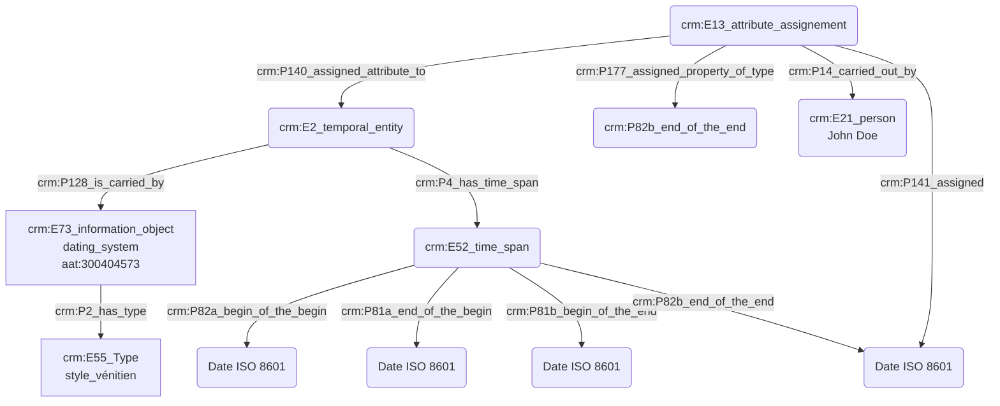

# Expression d'une incertitude

## a. Besoins musicologiques

Le chercheur en sciences humaines doit pouvoir exprimer une incertitude avec souplesse, afin de transmettre avec justesse l'information scientifique, tout en étant conscient de la nécessité informatique d'une date précise exprimée dans un format référence. Il faut ainsi fournir une méthode permettant l'expression de divers doutes, besoins, _etc_. Par exemple, dans les répertoires les plus anciens, l'exactitude des dates est souvent difficile à établir, voire contestée. Les propositions de datation doivent donc être argumentées et justifiées.

## b. Problématisation

On constate que le terme _circa_ est régulièrement employé, malgré son manque de précision ; il convient donc de trouver une solution technique pour exprimer le doute et les propositions de divers chercheurs sans pour autant les réduire.

## c. Contextualisation technique

Plusieurs instances de `crm:E13_Attribute_Assignment` viennent justifier les choix de datation, car toute attribution de date repose sur une interprétation, aussi minime soit-elle. 

## d. Proposition CIDOC CRM


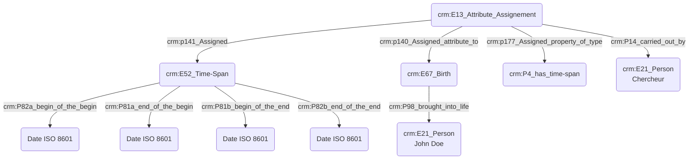

# Expression d'une date

## a. Besoins musicologiques

Le chercheur en sciences humaines doit pouvoir exprimer une date afin de transmettre avec justesse l'information scientifique, tout en étant conscient de la nécessité informatique d'une date précise exprimée dans un format référence. 

Les implications de la définition du temps ont été clairement soulignés par la mise en exergue de divers cas particuliers complexes, voire douteux. Dans le cas de _L’Heure espagnole_ de Ravel, la partition chant et piano a été publiée en 1908 mais l'orchestration réalisée en 1910. La première interprétation publique de l’opéra a eu lieu en 1911, la même année que la publication de la partition pour orchestre. Ce cas souligne donc la possibilité de multiplier les champs "date" correspondant aux diverses versions de l'œuvre.  

## b. Problématisation

Comment exprimer une date, dans un référentiel normé et informatiquement précis ? Nous devons également présenter une date calculable par la machine (c'est-à-dire exprimable en ISO 8601)afin de l'intégrer dans une représentation chronologique calculée des données. 

## c. Contextualisation technique

La meilleure manière d'exprimer une date est de la définir par le biais de deux intervalles, l'un exprimant l'incertitude sur son début, l'autre sur sa fin. Chacun est constitué de deux dates exprimées en ISO 8601 et peuvent être définis de quatre manières principales : 
 - Strictement contenu dans la période de recherche
 - Couvre la période de recherche
 - Commence avant la période de recherche et se termine en son sein
 - Commence pendant la période de recherche et se termine après

Dans le cas d'une date n'apparaîssant pas dans la source, les intervalles saisis par les chercheurs sont des reconstructions qui doivent être argumentées par un champ permettant d'exprimer un degré de certitude. 

Le système doit enregistrer chaque date soumise par les chercheurs comme des valeurs signées et datées, en ne considérant pas la valeur d'un champ date comme une donnée monolithique, mais comme un succession de contributions contextualisées, un peu à la manière d'un cahier de laboratoire.

## d. Proposition CIDOC CRM

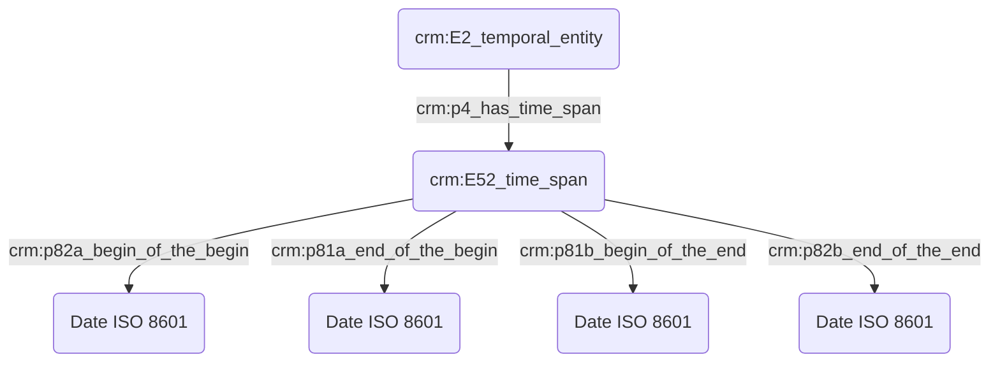

# Transcription d'une œuvre

## a. Besoins musicologiques

L'acte de transcription musicale implique un certain nombre d'entités qu'il convient d'identifier avec précision dans le cadre de l'indexation conceptuelle : œuvre originelle, œuvre transcrite, compositeur et transcripteur, dans l'éventualité où les deux tâches seraient accomplies par des personnes différentes.

## b. Problématisation

De quelle manière peut-on exprimer l'action de transcription d'une œuvre existante ? 

## c. Contextualisation technique

Nous nous appuyons sur le modèle FRBR pour caractériser l'œuvre ; dans le cadre d'une transcription, le niveau auquel nous nous intéressons est celui de l'expression et est intégré dans le graphe par l'usage de 'F2_expression', portées par des personnes 'E21_person' - clairement nommées et identifiées, si possible à l'aide d'une URI- , tandis que les actions de transcription et de composition sont typées à l'aide du Thésaurus Getty AAT. Celles-ci résultent en des 'F28_Expression_Creation'.

## d. Proposition CIDOC CRM


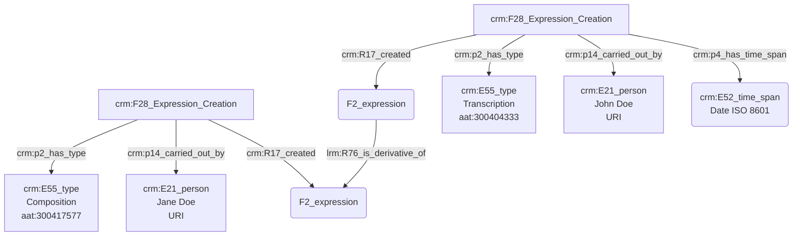


# Statut et fonction d'une personne fictive

## a. Besoins musicologiques

Lorsque dans certains récits - notamment mythologiques - certaines personnes sont évoquées et que leur existence réelle ne peut être prouvée, il est nécessaire de leur attribuer des caractéristiques les différenciant de personnes réelles. Par exemple, le personnage (fictif) incarné par un chanteur (personne réelle) au sein d'un Opéra. Il convient ensuite de détailler différents attributs du rôle vis-à-vis de l'univers dans lequel il s'inscrit.

## b. Problématisation

De quelle manière peut-on préciser le caractère fictif d'une personne ? 

## c. Contextualisation technique

Afin de préciser le caractère fictif d'une personne, nous prenons le parti d'utiliser un 'E13_attribute_assignement' auquel est assigné - à l'aide de la propriété ```crm:P141_assigned``` - un ```crm:E55_type "protagonist"``` référencé au sein du thésaurus Getty AAT. 

Pour exprimer le statut et/ou la fonction d'une personne au sein d'une institution, nous reprenons notre protocole détaillé dans la fiche _Statut ou fonction d'une personne réelle_. Nous exprimons la fonction d'une personne par l'usage de deux ```crm:E74_group``` ; le premier d'entre eux correspond à la structure qui accueille la personne et le second, inclus dans le premier, détaille la fonction occupée. Il est posssible de raffiner encore plus le processus par l'usage de ```crm:E74_group``` supplémentaires, jusqu'à arriver au niveau de précision attendu. Les concepts adjacents aux ```crm:E74_group``` sont typés à l'aide du Getty AAT pour assurer une interopérabilité maximale.

## d. Proposition CIDOC CRM

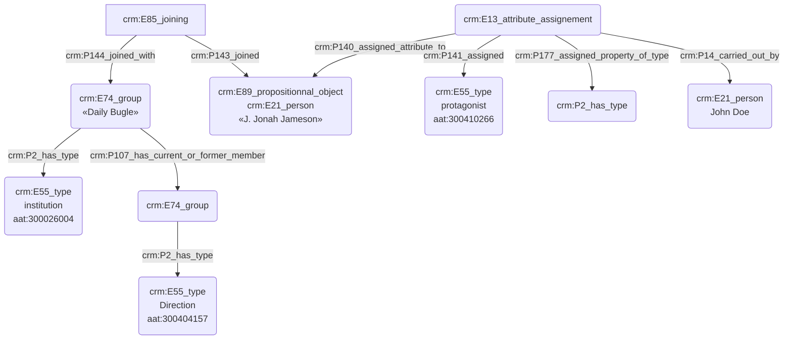

# Fréquentation d'une institution

## a. Besoins musicologiques

Il est souvent nécessaire de témoigner de la présence d'une personne au sein d'une institution, en détaillant s'il s'agit d'un simple passage ou bien d'une inscription réelle au sein de celle-ci. Nous avons donc besoin d'informations spatio-temporelles, mais aussi de typer les statuts et/ou fonctions des personnes concernées, tout en se référant à des ressources existantes telles que des thésaurus.

## b. Problématisation

Comment modéliser la présence d'une personne au sein d'une institution ? Quels sont les outils nous permettant de typer la nature de la fréquentation ?

## c. Contextualisation technique

Nous croisons ici l'usage de trois de nos protocoles ; sur les dates, les lieux et les statuts et fonctions. La mise en relation de ces derniers avec un 'E21_Person' permet de tisser des liens complémentaires entre l'individu et l'institution.

## d. Proposition CIDOC CRM

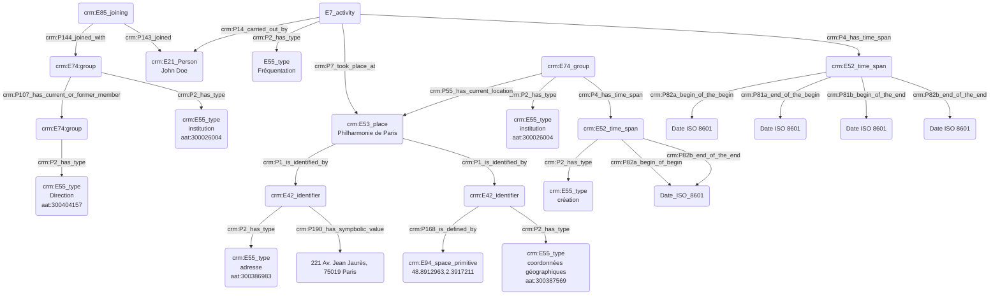


# Rencontre de quelqu'un par le biais d'une tierce personne au sein d'un même lieu

## a. Besoins musicologiques

De manière similaire à l'exemple précédent, le lien entre deux personnes peut naître de la rencontre d'une tierce personne qui va introduire les deux premières, facilité par la fréquentation commune d'un lieu. En ce sens, il est nécessaire de pouvoir modéliser la présence des trois personnes au même endroit mais aussi au même moment, afin de témoigner de leur rencontre, ainsi que l'action d'entremettage portée par la troisième personne.

## b. Problématisation

Comment exprimer le fait que deux personnes soient présentées l'une à l'autre par le biais d'une troisième, toutes trois ayant fréquentées le même lieu ?

## c. Contextualisation technique

Pour une raison de clarté de lecture, nous faisons le choix de présenter deux graphes distincts. Le premier, par l'usage de 'E7_activity' reliés à trois personnes montre les liens existants entre celles-ci. Le second graphe nous permet d'exprimer les informations liées au lieu ainsi qu'aux moments où les acitivités se sont déroulées.

## d. Proposition CIDOC CRM

### - Quelqu'un a rencontré quelqu'un par le biais d'une tierce personne au sein d'un même lieu :

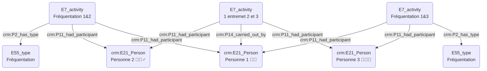

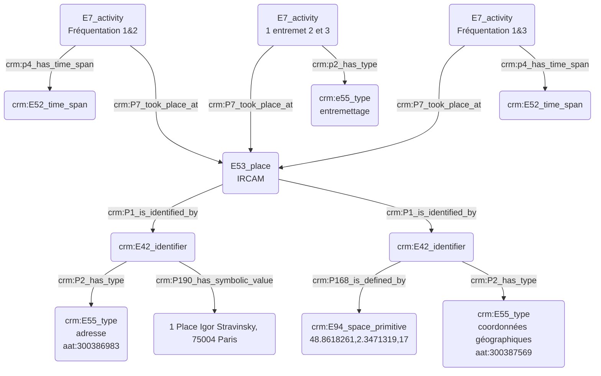


# Appartenance à un groupe social

## a. Besoins musicologiques

L'appartenance à un groupe - qu'il soit publiquement identifié (par exemple une association, une société savante, etc...) - ou bien lié à l'association plus ou moins informelle de diverses personnalités (par exemple, le "Groupe des six") permet de reconstituer des liens inter-personnels dans l'optique d'un travail de recherche musicologique. Nous pouvons ainsi témoigner d'une certaine influence esthétique chez une personne liée à la fréquentation d'un cercle promeuvant une certaine idéologie, _etc_.

## b. Problématisation

De quelle manière peut-on matérialiser l'appartenance à un groupe afin de témoigner d'une rencontre au sein d'un même cercle ?

## c. Contextualisation technique

Nous utilisons un 'E74_group' lié à la personne concernée par un 'E85_joining'. Le 'E74_group' doit nécessairement être typé, ici à l'aide du thésaurus Getty AAT, afin de représenter la fonction / valeur du groupe. La date d'entrée au sein du groupe est également indiquée ; à noter que si celle-ci est incertaine, il convient d'utiliser un 'E13_attribute_assignement' pour préciser le raisonnement derrière l'attribution de cette date.

**P107 est plus pauvre qu'utiliser un E85 voir la notion de shortcut en CIDOC CRM** 

## d. Proposition CIDOC CRM

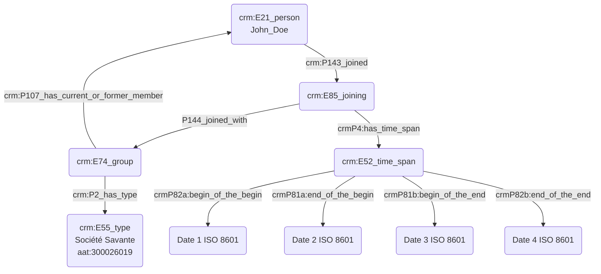

# Propriétaire d'un objet

## a. Besoins musicologiques

Dans le cadre d'études organologiques, il peut être intéressant de témoigner l'appartenance d'un instrument à une personne donnée, afin de retracer l'historique de l'instrument, étudier l'évolution de sa pratique, _etc_.

## b. Problématisation

Comment exprimer le fait qu'une personne soit propriétaire d'un objet ?

## c. Contextualisation technique

Nous utilisons ici un 'E13_attribute_assignement' pour commenter l'acquisition d'un objet physique 'E19_Physical_Object'. L'action d'acquisition est une activité 'E7_activity' typée à l'aide d'une entrée du Getty AAT.

## d. Proposition CIDOC CRM

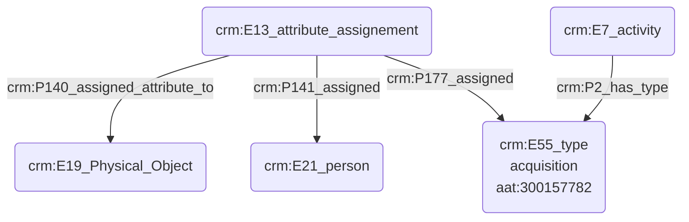
# Statut ou rôle au sein d'une institution

## a. Besoins musicologiques

Les rôles endossés par des personnes varient dans leurs appelations et significations au fil du temps. Il est donc important de pouvoir typer les responsabilités à l'aide d'un thésaurus, mais aussi de pouvoir exprimer un niveau de détail élevé vis-à-vis des informations à disposition, en faisant preuve de plus ou moins de précision.

## b. Problématisation

Comment exprime-t'on le statut et/ou la fonction d'une personne vis-à-vis de l'institution dont elle dépend ?

## c. Contextualisation technique

Nous présentons ici le protocole permettant de préciser le statut et/ou la fonction d'une personne au sein d'une institution. Nousavons fait le choix d'exprimer la fonction d'une personne par l'usage de deux 'E74_group' ; le premier d'entre eux correspond à la structure qui accueille la personne et le second, inclus dans le premier, détaille la fonction occupée. Il est posssible de raffiner encore plus le processus par l'usage de 'E74_group' supplémentaires, jusqu'à arriver au niveau de précision attendu. Les concepts adjacents aux 'E74_group' sont typés à l'aide du Getty AAT pour assurer une interopérabilité maximale.

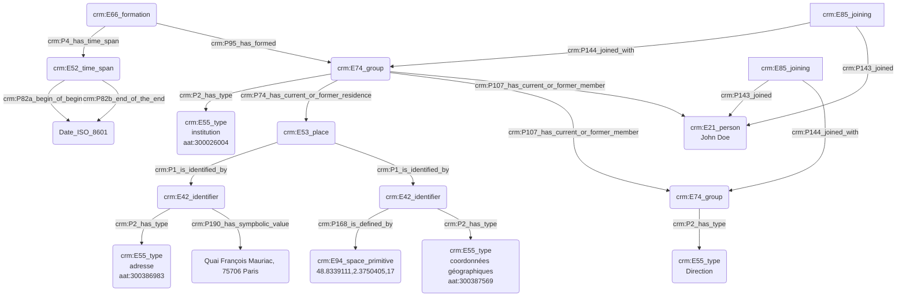


# Rencontre de quelqu'un dans un lieu fréquenté par les deux personnes

## a. Besoins musicologiques

Le lien entre deux personnes peut être établi à travers la fréquentation commune d'un lieu. En ce sens, il est nécessaire de pouvoir modéliser la présence des deux personnes au même endroit mais aussi au même moment, afin de témoigner de leur rencontre.

## b. Problématisation

Comment exprime-t'on la présence simultanée de deux personnes au sein d'un même lieu, et le fait qu'elles se rencontrent ?

## c. Contextualisation technique

Nous utilsons un ```crm:E7_activity``` pour désigner l'action de rencontre, ensuite typée à l'aide d'une entrée du Getty AAT. Cette rencontre est enrichie d'une date, marquant la simultanéité de la présence des deux personnes, et des informations concernant le lieu.

## d. Proposition CIDOC CRM

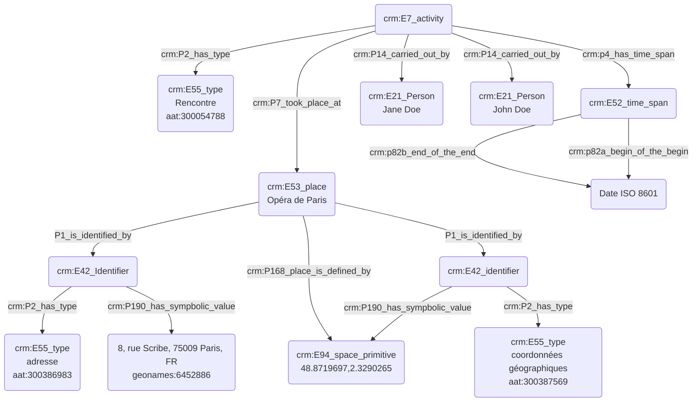


# Relation de maître à élève

**_Faire une autre fiche cf situation pédago avec une classe_**

## a. Besoins musicologiques

Nous avons besoin de représenter la situation pédagogique d'apprentissage de deux points de vue ; autant de l'apprenant que de l'enseignant. Il peut également être nécessaire de situer cette situation dans un espace-temps donné, afin de la relier à des événements, ou bien à une institution si celle-ci s'est déroulée dans ce cadre précis. 

## b. Problématisation

De quelle manière peut-on exprimer une relation de maître à élève des deux points de vue, ainsi que son inscription dans différents contextes ?

## c. Contextualisation technique

Cet exemple fait usage d'un certain nombre de 'E7_activity' permettant de définir de manière précise les différentes étapes d'une situation pédagogique : l'apprentissage, l'enseignement, et la situation pédagogique en elle-même. Ces activités sont typées à l'aide du thésaurus Getty AAT afin de permettre une meilleure interopérabilité.

## d. Proposition CIDOC CRM

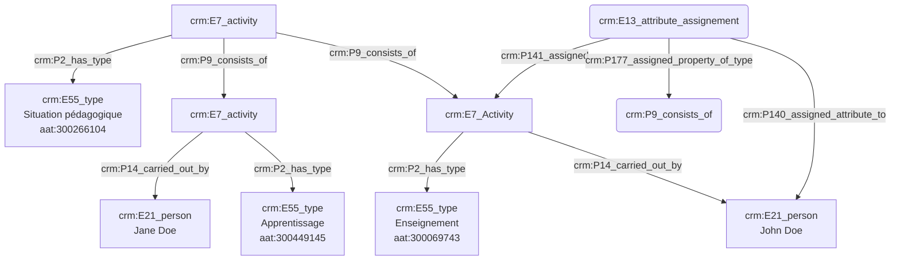


# Fréquentation d'un lieu à un instant donné

## a. Besoins musicologiques

Les chercheurs ont besoin de témoigner de manière normée de la présence d'une ou plusieurs personnes au sein d'un espace-temps normé, avec une date précise exprimée dans un format référence. 

## b. Problématisation
 
Comment peut-on exprimer la présence d'une personne physique dans un lieu donné, au sein d'une période de temps définie par le chercheur ? Nous ne nous posons pas encore la question des outils de modélisation pour la définition de la personne dans le cadre de cet exemple, mais son rôle et son statut peuvent être précisés.

## c. Contextualisation technique

L'utilisation d'un 'E13_attribute_assignement' permet l'expression de l'incertitude quant à la présence ('E93_presence') d'une personne à un lieu et un endroit donnés. Nous utilisons à nouveau notre protocole complet d'identification d'un lieu par ses coordonnées GPS ('E94_space_primitive') ainsi que par son adresse, complétée par un identifiant _geonames_, tandis que les deux 'E42_identifier' sont typés par des entrées du thésaurus Getty AAT.

## d. Proposition CIDOC CRM

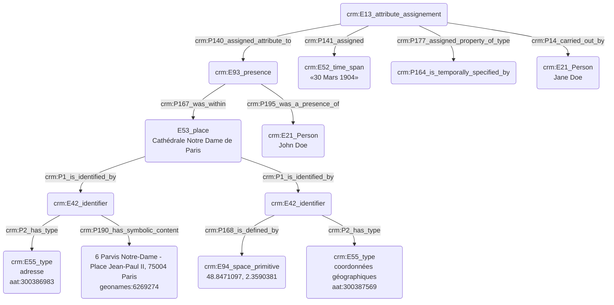


# Modélisation d'une institution

## a. Besoins musicologiques

De toutes époques, les institutions sont au cœur de la vie musicale. Elles peuvent tout autant accueillir des concerts que passer commande aux compositeurs, tout en insufflant des directives artistiques. Il est alors nécessaire de pouvoir les modéliser dans toute leur complexité, en indiquant leurs coordonnées géographiques - dépendent-elles d'un lieu bien spécifique ? -, la date de leur création ou bien l'arrivée d'une nouvelle direction, _etc_... 

## b. Problématisation

Comment représenter l'existence d'une institution, son domaine de rattachement mais aussi des données plus empiriques telles que le lieu où elle est établie, sa date de création,_etc_ ?

## c. Contextualisation technique

Le thésaurus Getty AAT permet de caractériser la typologie "institution" à l'aide d'un vocabulaire contrôlé, dont la définition est la suivante : "[nous traduisons] Organisations, associations ou établissements formellement structurés afin de promouvoir un objectif public ou privé spécifique, généralement un objectif religieux, caritatif ou éducatif." En partant de ce postulat, nous exprimons ensuite les caractéristiques principales de l'institution d'après les protocoles auparavant présentés : lieu où elle se trouve, date de création, _etc_.

## d. Proposition CIDOC CRM

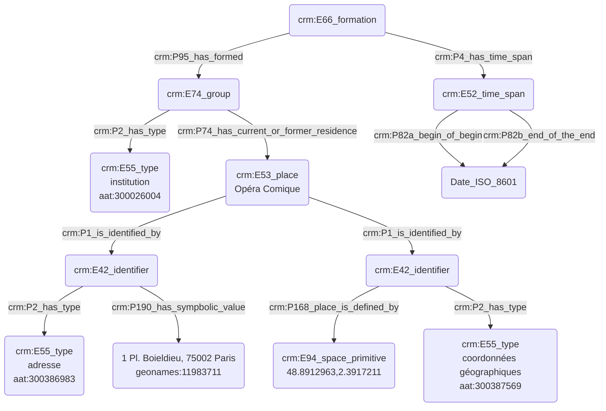


# Dédicataire d'une œuvre

## a. Besoins musicologiques

La dédicace d'une œuvre musicale diffère de la commande dans la mesure où n'elle n'induit aucun soutien financier, à moins que le commanditaire et le dédicataire soient la même personne. Le dédicataire peut-être un proche du compositeur, mais aussi une figure publique ; il peut s'agir d'un témoignage d'affection mais aussi d'admiration, sans nécessairement signaler un lien de proximité dans la vie réelle.

## b. Problématisation

Comment exprimer la dédicace, mention textuelle présente au sein de la partition ? Il s'agira également de distinguer clairement cette notion de la commande en marquant la différence entre l'aspect institutionnel de la commande et l'aspect plus personnel de la dédicace, mais aussi de distinguer l'étape de l'œuvre où la dédicace est fixée. 

## c. Contextualisation technique

Nous utilisons à nouveau le modèle FRBR pour type l'œuvre, qui se présente ici au niveau d'_expression_, puis de _manifestation_ une fois éditée. C'est lors de la création de l'expression que se décide la dédicace, qui sera ensuite _physiquement_ fixée sur la _manifestation_.
Le thesaurus Getty AAT est à nouveau utilisé afin de typer les différentes activités mais aussi statuts du graphe CIDOC CRM. Dans le cadre d'un cas concret, nous pourrons également ajouter des URI pour un niveau de précision accru. Nous faisons également appel au modèle FRBR en mettant en exergue la manifestation sur laquelle apparait la dédicace, représentée par l'entité ```crm:E34_inscription``` qui témoigne de la précense de la référence sur la source.

## d. Proposition CIDOC CRM

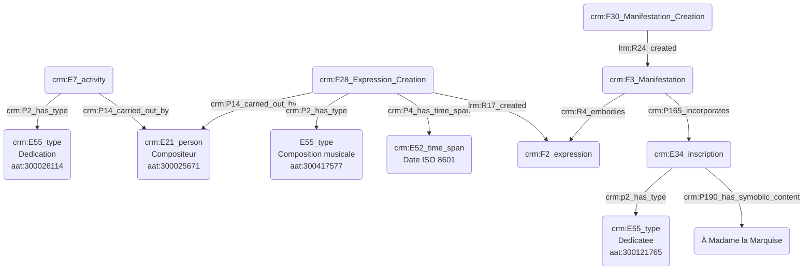


# Caractérisation d'une personne

## a. Besoins musicologiques

**_éléments pour la description d'une personne_**

Afin d'indexer une personne, nous avons dans un premier temps besoin d'informations biographiques basiques liées aux dates de naissance et de mort de l'individu. Nous pourrons, le cas échéant, exprimer de manière idoine aux exemples présents au sein du module _datation_ diverses incertitudes où des inscriptions dans des référentiels calendaires plus rares. La fonction et/ou le statut occupé par la personne sont également des éléments nous permettant d'indexer. 

## b. Problématisation

## c. Contextualisation technique

On exprime en premier lieu l'existence d'une personne par ses dates de naissance 'E67_birth' et de mort 'crm:E69_death', avant de typer différentes entités liés à son inscription dans divers groupes au fil de sa vie. L'usage de 'E13_attribute_assignement' permet de commenter et témoigner des incertitudes vis-à-vis de certaines informations.

## d. Proposition CIDOC CRM

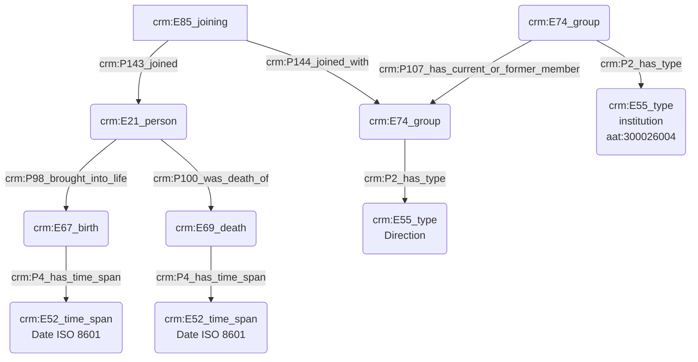


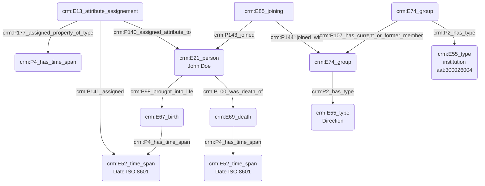

# Caractérisation d'une personne morale

## a. Besoins musicologiques

Une personne morale est, par définition, une entité regroupant divers individus regroupés sous un statut juridique, œuvrant de manière commune. Afin d'indexer une personne morale, il convient de signaler plusieurs éléments majeurs : les différentes personnes le composant, le statut juridique, la date de création de l'entité, le lieu éventuel où son bureau est établi, _etc._

## b. Problématisation

De quelle manière peut-on indiquer les caractéristiques principales d'une personne morale et les modéliser ?

## c. Contextualisation technique

Nous faisons ici usage de l'entité 'E66_formation', qui permet de témoigner de la création d'un 'E74_group'. Nous utilisons à nouveau notre protocole de datation ainsi que des entrées du thésaurus Getty AAT afin de typer les concepts d'_institution_, d'_adresse_ ou encore de _coordonnées géographiques_.

## d. Proposition CIDOC CRM

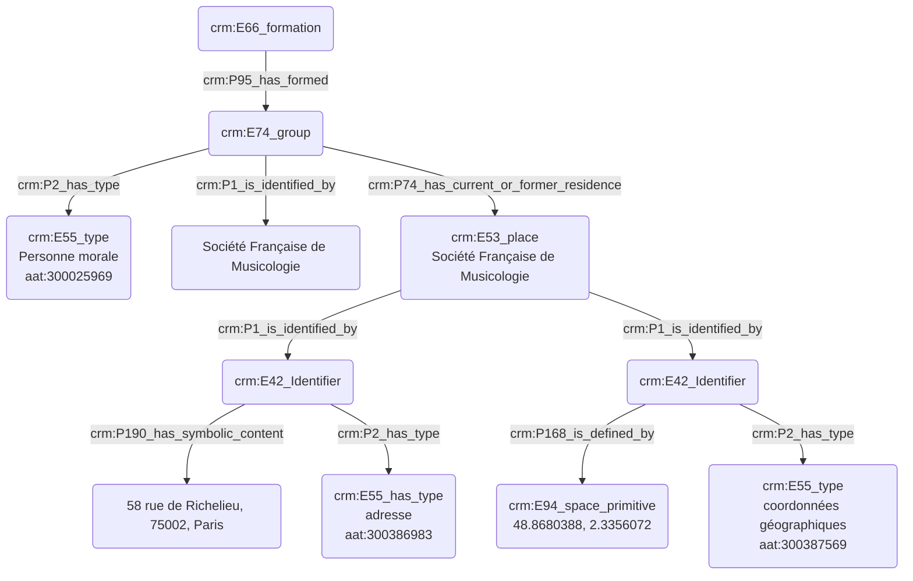

# Statut et fonction d'une personne réelle

## a. Besoins musicologiques

Les rôles endossés par des personnes varient dans leurs appellations et significations au fil du temps. Il est donc important de pouvoir typer les responsabilités à l'aide d'un thésaurus, mais aussi de pouvoir exprimer un niveau de détail élevé vis-à-vis des informations à disposition, en faisant preuve de plus ou moins de précision.

## b. Problématisation

Comment exprime-t'on le statut et/ou la fonction d'une personne vis-à-vis de l'institution dont elle dépend ?

## c. Contextualisation technique

Nous présentons ici le protocole permettant de préciser le statut et/ou la fonction d'une personne au sein d'une institution. Nous avons fait le choix d'exprimer la fonction d'une personne par l'usage de deux 'E74_group' ; le premier d'entre eux correspond à la structure qui accueille la personne et le second, inclus dans le premier, détaille la fonction occupée. Il est possible de raffiner encore plus le processus par l'usage de 'E74_group' supplémentaires, jusqu'à arriver au niveau de précision attendu. Les concepts adjacents aux 'E74_group' sont typés à l'aide du Getty AAT pour assurer une interopérabilité maximale.

## d. Proposition CIDOC CRM

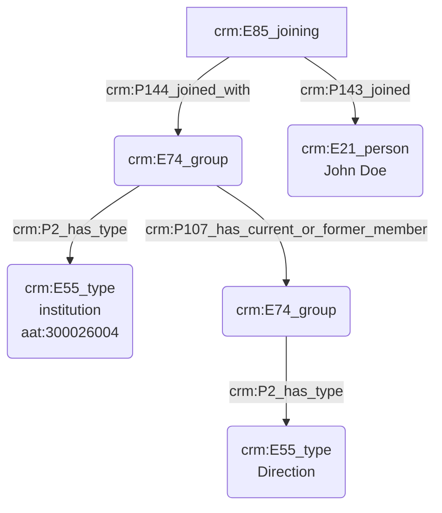


# Commanditaire d'une œuvre

## a. Besoins musicologiques

Nous avons besoin de modéliser la relation liant le commanditaire d'une œuvre au compositeur, ainsi que la pièce résultant de cette demande, le plus souvent caractérisée par une rétribution financière. Le commanditaire est souvent une personne morale (institution) plus qu'une personne physique ; nous nous attacherons néanmoins à expliciter ces deux possibilités distinctes. 

## b. Problématisation 
 
De quelle manière peut-on révéler l'aspect conséquentiel de l'œuvre - son écriture - suite à l'action du commanditaire et au passage de la commande ?

## c. Contextualisation technique

L'œuvre est exprimée selon le référentiel FRBR, se trouvant ici à son niveau le plus fondamental - _work_ -.
Le thesaurus Getty AAT nous permet de typer l'action de commande, tandis que l'institution est inscrite dans un champ spatio-temporel car étant le plus souvent reliée à un lieu bien précis, dans notre exemple l'Opéra de Paris, désigné selon notre protocole (voire [fiche dédiée]([https://github.com/Amleth/consortium-musica2-gt2-ontologies/blob/main/modules/livrables/Dossier%202/Indexation%20conceptuelle/indexation_d_un_lieu.md])). La date de commande de l'œuvre est  indiquée, ainsi que sa date de finalisation (date de rendu de la partition au commanditaire). 

## d. Proposition CIDOC CRM

```mermaid
graph TD;

M(crm:F27_work_creation) --> |crm:P9_consists_of| A(crm:F27_work_creation)
M(crm:F27_work_creation) --> |crm:P9_consists_of| C(crm:E7_activity)

A(crm:F27_work_creation) --> |lrm:R16_created| B(crm:F1_work)
A(crm:F27_work_creation) --> |crm:P2_has_type| N(E55_type<br>Composition musicale<br>aat:300417577)
A(crm:F27_work_creation) --> |crm:P4_has_time_span| J(crm:E52_time_span<br>Date ISO 8601)
A(crm:F27_work_creation) --> |crm:P14_carried_out_by| L(crm:E21_person<br>Compositeur<br>aat:300025671)

C(crm:E7_activity) --> |crm:P2_has_type| D(crm:E55_type<br>Commande<br>aat:300400904)
C(crm:E7_activity) --> |crm:P14_carried_out_by| E(crm:E74_group)
C(crm:E7_activity) --> |crm:P4_has_time_span| K(crm:E52_time_span<br>Date ISO 8601)
E(crm:E74_group) -->|crm:P2_has_type| F(crm:E55_type<br>institution<br>aat:300026004)
E(crm:E74_group) --> |crm:P74_has_current_or_former_residence| I(crm:E53_place<br>Opéra de Paris)
I(crm:E53_place<br>Opéra de Paris) --> |crm:P1_is_identified_by| V(crm:E42_Identifier)
V(crm:E42_Identifier) --> |crm:P168_is_defined_by| G(crm:E94_space_primitive<br>48.866667, 2.333333)
V(crm:E42_Identifier) --> |crm:P2_has_type| W(crm:E55_type<br>coordonnées géographiques<br>aat:300387569)

I(crm:E53_place<br>Opéra de Paris) --> |crm:P1_is_identified_by| S(crm:E42_Identifier<br>Quai François Mauriac, 75706 Paris)
S(crm:E42_Identifier) --> |crm:P2_has_type| T(crm:E55_type<br>adresse<br>aat:300386983)
S(crm:E42_Identifier) --> |crm:P190_has_sympbolic_value| U(8, rue Scribe, 75009 Paris, FR)


```


# Caractérisation d'un lieu 

## a. Besoins musicologiques

Lors du processus d'indexation conceptuelle, il est nécessaire de distinguer les lieux à l'aide de divers critères remarquables, tout en prenant soin - si besoin est - de relier chaque lieu à l'institution qu'il incarne. Il est également important de fournir des coordonnées GPS afin de pouvoir saisir la position géographique réelle du lieu, par exemple si l'institution a eu plusieurs sièges au fur et à mesure des années.

## b. Problématisation 

Comment modéliser un lieu tout en faisant apparaître l'institution à laquelle il se rattache, mais aussi son adresse ?

## c. Contextualisation technique

Cet exemple nous permet de présenter notre protocole complet d'identification des lieux, offrant une interopérabilité et une précision maximales. Nous faisons le choix de désigner le lieu tant par ses coordonnées géographiques que par son adresse :

Deux 'E42_identifier' sont reliés au 'E53_place'. Le premier d'entre eux signale ses coordonnées GPS ('E94_space_primitive')et le second son adresse, complétée par un identifiant geonames. Les deux concepts exprimés 'E42_identifier' sont typés par des entrées du thésaurus Getty AAT afin d'assurer une compréhension égale pour tous les usagers du protocole tout en assurant son interopérabilité. L'institution est également typé de manière similaire.

Les deux axes choisis se complètent et permettent de typer tout autant des lieux anciens, n'existant plus désormais ou bien ayant changé de localisation, qu'un site précis au sein d'un lieu en comportant plusieurs, comme c'est le cas pour la Bibliothèque Nationale de France.

## d. Proposition CIDOC CRM

```mermaid
graph TD;

A(crm:E53_place<br>Site Tolbiac) --> |crm:P1_is_identified_by| B(crm:E42_identifier)
A(crm:E53_place<br>Site Tolbiac) --> |crm:P1_is_identified_by| S(crm:E42_identifier)
S(crm:E42_identifier) --> |crm:P168_is_defined_by| Z(crm:E94_space_primitive<br>48.8493676,2.3366315,14)
S(crm:E42_identifier) --> |crm:P2_has_type| N(crm:E55_type<br>coordonnées géographiques<br>aat:300387569)

B(crm:E42_identifier) --> |crm:P2_has_type| X(crm:E55_type<br>adresse<br>aat:300386983)
B(crm:E42_identifier) --> |crm:P190_has_sympbolic_value| Y(«Quai François Mauriac, 75706 Paris»)


C(crm:E74_group<br>«Bibliothèque Nationale de France») --> |crm:P74_has_current_or_former_residence| A(crm:E53_place<br>Site Tolbiac)
C(crm:E74_group<br>«Bibliothèque Nationale de France») --> |crm:P2_has_type| H(crm:E55_type<br>Institution<br>aat:300026004)

```

**a. Besoins musicologiques**

**b. Problématisation**

**c. Contextualisation technique**

**d. Proposition CIDOC CRM**

```mermaid
graph TD;

A(lrm:F28_expression_creation<br>Variation V) -->|frbr:R17_created| B(lrm:F2_expression<br>37 remarques à partir d'une production audiovisuelle)

A(lrm:F28_expression_creation<br>Variation V) --> |crm:P9_consists_of| E(crm:E7_activity<br>Composition) 
E(crm:E7_activity<br>Composition) --> |crm:P2_has_type| S(crm:E55_type<br>Micro-composition)
D(crm:E7_activity<br>Composition) --> |crm:P2_has_type| G(crm:E55_type<br>Macro-composition)
A(lrm:F28_expression_creation<br>Variation V) --> |crm:P9_consists_of| F(crm:E7_activity<br>Composition)
D(crm:E7_activity<br>Composition) --> |crm:P14_carried_out_by| R(crm:E21_person<br>John Cage)
F(crm:E7_activity<br>Composition) --> |crm:P2_has_type| T(crm:E55_type<br>Micro-composition)
E(crm:E7_activity<br>Composition) --> |crm:P14_carried_out_by| H(crm:E21_person<br>David Tudor)
F(crm:E7_activity<br>Composition) --> |crm:P14_carried_out_by| I(crm:E21_person<br>Robert Moog)
A(lrm:F28_expression_creation<br>Variation V) --> |crm:P9_consists_of| D(crm:E7_activity<br>Composition)
B(lrm:F2_expression<br>37 remarques à partir d'une production audiovisuelle) --> C(crm:P2_has_type<br>Partition)

W(crm:E12_creation) --> |crm:P2_has_type| X(crm:E55_has_type<br>Enregistrement)
Y(lrm:F5_item) --> |crm:P2_has_type| V(crm:E55_type<br>Bande)
W(crm:E12_creation) ---> |crm:P14_carried_out_by| R(crm:E21_person<br>John Cage)
W(crm:E12_creation) --> |crm:P108_has_produced| Y(lrm:F5_item)

O(lrm:F28_expression_creation<br>Variation V) -->|crm:P14_carried_out_by| Q(crm:E21_person<br>Merce Cunningham)
O(lrm:F28_expression_creation<br>Variation V) -->|frbr:R17_created| K(lrm:F28_expression_creation<br>Chorégraphie)

P(lrm:F28_expression_creation<br>Variation V) -->|crm:P14_carried_out_by| L(crm:E21_person<br>Nam June Paik)
P(lrm:F28_expression_creation<br>Variation V) -->|frbr:R17_created| M(crm:E36_visual_item)
M(crm:E36_visual_item) --> |crm:p2_has_type| N(crm:E55_type<br>TV Pictures)

Z(lrm:F1_work<br>Variation V) -->|mus:U5_had_premiere| AA(lrm:F31_performance)
AA(lrm:F31_performance) --> |crm:P7_took_place_at| AB(crm:E53_place<br>NY)
AA(lrm:F31_performance) -->|crm:P4_has_time_span| AC(crm:E52_time_span)
AC(crm:E52_time_span) -->|crm:P82a_begin_of_begin| AD(23/07/1965)
AC(crm:E52_time_span) -->|crm:P82b_end_of_the_end| AD(23/07/1965)

```


## 1. Présentation générale de l'approche méthodologique

Ce document vise à proposer un protocole détaillé de renseignement des métadonnées au sein des headers MEI dans le cas d'éditions critiques sous format numérique. Notre objectif est d'établir une sorte de guide spécifique pour les éditions critiques en MEI et de préciser où placer les informations philologiquement nécessaires, en proposant des choix réflechis au détriment de la liberté habituellement accordée à l'encodeur par le lignes guides MEI. Fixer des paramètres partagés et réconnus par la communauté musicologique permettra de créer de fichiers MEI qui pourront être contrôlés, vérifiés et échangés au profit de la transparence scientifique et de l'interopérabilité. Pour ce faire, le modèle FRBR appliqué à l'encodage MEI sera privilégié et suivi d'une manière ponctuelle. 

Les besoins de l'édition critique textuelle se sont historiquement structurés à partir de deux modèles philologiques principaux. Le premier d'entre eux, que l'on doit à l'allemand Karl Lachmann (1793 - 1851), s'articule en cinq points, en débutant par la _recensio_, soit l'identification des sources et l'étude de la tradition. La _recensio_ consiste en deux étapes, la première desquelles s'occupe de différencier les sources de la « tradition directe » - tous les exemplaires qui transmettent l'œuvre en question - et les sources de la « tradition indirecte » – les traductions, citations, commentaires et parodies. Une fois cette première étape terminée, la seconde étape de la _recensio_ peut s'effectuer afin de procéder au dépouillement des toutes les sources recoltées et au recensement détaillé proprement dit. Le troisième point de la méthode est la _collatio_, qui consiste en la compairaison systématique des variantes et des erreurs attestés dans les sources, avant de démarer une étape plus critique, l'_eliminatio codicum descriptorum_, qui consiste à éliminer les exemplaires qui sont la copie exacte d'autres exemplaires conservés, afin de constituer un corpus cohérent et propice au _stemma codicum_, la dernière étape du processus consistant en la détermination de la relation entre les sources. Cette dernière étape permet l'établissement d'un arbre généalogique des sources représentant la tradition d'une œuvre.

La seconde méthode, établie par Joseph Bédier (1864-1938), critique fondamentalement la méthode de Lachmann : le _stemma codicum_ aboutit dans la majorité des cas à une représentation de la tradition articulée en deux branches. La critique de Bédier va en effet porter sur la difficulté de retrouver avec certitude les branches hautes du _stemma_, et sur ce qui lui semble l’indice du vice fondamental d’une telle ambition : l’abondance suspecte, dans les éditions critiques, des _stemmas_ bifides menant au blocage, par impossibilité de choisir laquelle des deux branches est la plus proche de l’original. Ce scepticisme va mener Bédier à suspendre l’activité reconstructive pour privilégier le texte d’un « bon » manuscrit en le retouchant le moins possible. De la méthode Lachman, Bédier sauve les deux premiers points - les deux étapes de la _recensio_ - qui restent l'outil scientifique indispensable du travail d'un éditeur afin d'effectuer une étude approfondie et complète de la tradition d'une œuvre. Cette méthode, également dite du « bon manuscrit » vise à choisir d'emblée la source la moins corrompue afin qu'elle constitue la base de l'édition critique ; les éventuelles erreurs contenues dans cette source seront corrigées au fur et à mesure du processus par les déductions du philologue (_ope ingenii_).

Bien que ces deux modèles soient les plus importants, il existe également une troisième méthode "synthétiste", ou mieux "néolachmanienne", de l'école philologique italienne [Michele Barbi (1867-1941), Giorgio Pasquali (1885-1952), Gianfranco Contini (1912-1990)], qui reprend la méthode de Lachmann, en gardant ses cinq points fondamentaux et en introduisant plusieurs correctifs méthodologiques visant à répondre aux critiques de Bédier. Un autre positionnement méthodologique en matière de philologie musicale est celle du _Copy-text_, notamment utilisé par Philip Gossett (1941-2017) dans le cadre de l'édition critique des opéras de Rossini et de Verdi.

Dans le cadre de la présentation de notre protocole de renseignement des métadonnées au sein des headers MEI pour l'établissement d'éditions critiques, nous prenons donc comme point d'appui la partie sur laquelle toutes les méthodes semblent converger : celle de la _recensio_, qui nous offre ainsi un socle pour entrevoir les éléments à renseigner dans le header MEI, en suivant les entités FRBR.

## 2. Approche des GT1 et GT2 pour la complétion des headers MEI

L'appui sur les normes FRBR nous parait central, afin de rendre interopérables les éditions critiques encodées en MEI : la tendance de laisser le maximum de liberté à l'encodeur pour le renseignement des métadonnées dans le header Mei mine l'interopérabilité des fichiers MEI ainsi produits, résultats de la sensibilité de chaque encodeur et de son interprétation personnelle. La création de fichiers MEI hétéroclites empêche également la trasparence scientifique qui se doit à une édition critique, dont la précision du travail fait en amont de la _restitutio textus_ doit toujours être vérifiable et immédiatement repérable. D'où l'urgence de fixer un protocole de saisie partagé par la communauté scientifique. Dans ce cadre, les normes FRBR proposées par le biais de la MEI, qui à partir de l‘œuvre s'articulent en listes des expressions, des manifestations puis des items, correspondent précisement à la _recensio_ la plus complète possible, ce qui est la premesse méthodologique de chaque édition critique : le header MEI doit donc suivre l'arborescence FRBR et être renseigné de la manière la plus rigoureuse possible. Dans notre protocole, il est fortement recommandé de se tenir au principe de la redondance : toutes les informations nécessaires doivent être renseignées à chaque niveau du modèle FRBR. Il est ainsi probable que des métadonnées soient régulièrement répétées, par exemple le nom du compositeur ou le titre de l’œuvre.

Nous détaillons ci-dessous notre protocole en prenant appui sur le modèle des _guidelines_ MEI, afin d'en faciliter l'approche. Notons que des exemples concrets sont joints au sein du _repository_, ainsi qu'un modèle vierge qui pourra être copié et rempli au sein des headers des utilisateurs, pour une interopérabilité maximale. 

- _meiHead_
   - Le Mei Header est le lieu approprié pour accueillir toutes les métadonnées concernant les sources sur lesquels se base l'édition critique. D'un point de vue technique il s'agit de procéder avec une _recensio_ complète, qui regroupe toutes les sources de la tradition directe (celle de la "expression" principale de l'œuvre) et tradition indirecte (celle qui prend en compte toute autre "expression" : traductions, parodies, commentaires/gloses, _scholiae_, citations, etc.)

**On utilise 0 lorsque l'on est en presence de la source originale (normalement l'autographe de l'œuvre) et oméga "⍵" lorsque la source originale de l'œuvre ne nous est pas parvenue**

- _fileDesc_
   - **Idem**
- _sourceDesc_ Ce module est l'élément central de notre protocole, puisque qu'il s'agit de la partie où nous décrivons de manière exacte le contenu scientifique. Selon les _guidelines_ MEI, il n'y a pas de renvoi au modèle FRBR au sein de _workList_. Il faut donc déployer le modèle FRBR à cet endroit.
   - _expressionList_ : il s'agit de nommer et détailler les différentes expressions, cette étape correspondant à notre protocole à la _recesio_ et donc à un discours commun aux théories de Lachmann et Bédier. Nous avons fait le choix de nommer l'expression de tradition directe _expression 0_. Les expressions indirectes se déploient ensuite avec des chiffres (1,2 _etc_) ou bien des noms en toutes lettres.
   - _manifestationList_ : de manière similaire à _expressionList_, nous nommons le manuscrit autographe (ou l'_omega_ issu du _stemma codicum_ si l'on ne possède pas l'autographe) _manifestation 0_. Pour chaque expression il convient d'utiliser une isntance de _manifestationList_ et pour chaque manifestation un _itemList_. Dans le cadre de manuscrits, la manifestation et l'item ne font qu'un. Par ailleurs, il n'y a pas, pour des raisons de catalogage évidentes, d'_item 0_ ; nous partons donc du principe que la dénomination des items fait appel au bon sens des chercheur·euse·s, de la tradition et des nomenclatures en usage.
   - 
   - **_Manifestation R7_is_exemplified_by Item_**
   - 
   - Le fichier MEI que nous sommes en train de renseigner constitue d'ailleurs une autre manifestation de l'œuvre, et doit par conséquent faire partie de la _manifestation_list_. Des xmlID seront utilisés pour chaque manifestation et item, afin d'assurer une inter-opérabilité maximale.

Le principal atout de notre protocole est l'interopérabilité, couplé à une réelle exhaustivité. Bien que sa réalisation puisse être fastidieuse de par le nombre important d'éléments à renseigner, le protocole porte une réelle valeur philologique et ainsi parfaitement adapté dans le cadre de l'édition critique, mais aussi au partage de fichiers au sein de la communauté internationale MEI.

**Faire un diagramme / en reparler avec Thomas et Marco**

## 3. Pour conclure

Paragraphe final pour maintenir la section _source_desc_ auprès de la communauté MEI car il permet d'exprimer au mieux, document considéré comme un "manifeste méthodologique"

## 4. Modules

_4. 1. Éclairer les approches de la _recensio__
  
tradition directe (tous les exemplaires liés directement au texte, cad tous les exemplaires qui transmettent le texte tel qu'il est) ou indirecte (exemplaires qui témoignent d'une tradition en parallèle : les traductions, des textes qui font référence et qui citent, les commentaires, les parodies, etc... / utile lorsqu'un texte est corrompu, car fenêtre sur un moment historique précis où le texte n'était pas corrompu) ? La tradition inderecte correspond à notre _expression_list_
--> exemple de Sophie : une expression, deux manifestations, deux items.

  Il s'agira donc de rentrer dans le détail de l'organisation MEI/FRBR de expressionList, manifestationList et itemList => un document fils pour chaque de ce trois 'chapitres'.

   - Trouver un cas où on a pas l'autographe mais où on l'a reconstitué, ce serait intéressant

_4. 2. Usage du CIDOC CRM_
   
choisir un thésaurus ?
**il nous est nécessaire de concevoir une batterie de types E55 pour typer les différents niveaux des sources d'après le modèle FRBR**

 


 - - -

Faire valider par Kévin pour la place du modèle FRBR, pour nous c'est dans <workList>
Marco a donné des gens à contacter pour partager tout ça : Laurent Pugin, Johannes Kepper (va s'opposer ; attention on tient aux protocoles pour l'interopérabilité) 

# Indexation d'une thématique

Au-delà des mots-clés abordés ci-avant, les sources historiques musicologiques sont souvent identifiés à l'aide de critères thématiques. Ce cas examine la modélisation de l'indexation d'une source à l'aide d'une thématique issue d'un thésaurus.

## b. Problématisation

De quelle manière peut-on indexer une source à l'aide d'une thématique ?

## c. Contextualisation technique

Nous utilisons ici le 'E13_attribute_assignement' afin d'attribuer une thématique à une source. Nous faisons usage du terme _Subject headings_, issu du Getty AAT. Celui-ci permet d'exprimer des thématiques complexes, puisqu'il "combine ensemble plusieurs concepts uniques en une seule séquence de mots". Les thématiques, portées par un 'E62_string' sont également tirées du Getty AAT.

## d. Proposition CIDOC CRM


```mermaid
graph TD;

D(crm:E13_attribute_assignement) --> |crm:P140_assigned_attribute_to| A(crm:E28_conceptual_object)
D(crm:E13_attribute_assignement) --> |crm:P141_assigned| B(«Symphonies de Mahler»)
D(crm:E13_attribute_assignement) --> |crm:P177_assigned_property_of_type| C(crm:E55_type<br>Subject headings<br>300265269)
D(crm:E13_attribute_assignement) --> |crm:P14_carried_out_by| F(crm:E21_person<br>John Doe)

```

# Indexation d'une source avec un mot-clé

## a. Besoins musicologiques

Les sources historiques musicologiques sont souvent identifiés à l'aide de critères spécialisés liés à des notions théoriques ou esthétiques, en plus des informations de temps et d'espace. Des mots-clés sont alors définis par la personne en charge de l'indexation et appliqués à différentes sources afin de les typer. Il est donc nécessaire de pouvoir modéliser l'indexation d'une source à l'aide d'un mot clé issu d'un thésaurus.

## b. Problématisation

De quelle manière peut-on indexer une source à l'aide d'un mot-clé ?

## c. Contextualisation technique

Nous utilisons ici le 'E13_attribute_assignement' afin d'attribuer un mot clé à une source. Le concept de "mot-clé" porté par un 'E62_string' est lui-même typé à l'aide du Getty AAT, tandis que les mots-clés eux-mêmes sont également piochés au sein de ce thésaurus.

## d. Proposition CIDOC CRM

```mermaid
graph TD;

D(crm:E13_attribute_assignement) --> |crm:P140_assigned_attribute_to| A(crm:E73_information_object)
D(crm:E13_attribute_assignement) --> |crm:P141_assigned| B(crm:E55_type<br>Symphonie<br>aat:300400547)
D(crm:E13_attribute_assignement) --> |crm:P177_assigned_property_of_type| C(crm:E55_type<br>keyword<br>aat:300311841)
D(crm:E13_attribute_assignement) --> |crm:P14_carried_out_by| F(crm:E21_person<br>John Doe)

```

